# Spherical image representations for 360° panoramas: Phase 1 report

Experiments run on 2026-10-01 and 2026-10-02 against FOSS Earth `4866615` and the UMN tour `9e8a058`, on one
desktop machine. No production code was changed, and the benchmark was committed only after
its runs, so the results name the commit it was written on. How to run
everything is in [README.md](README.md); what existed beforehand is in
[INVENTORY.md](INVENTORY.md); every number below comes from `results/`, and
[results/tables.md](results/tables.md) regenerates the derived ones.

The question was which spherical grid, and which way of refining it, shows the best picture
for a given number of bytes, a given time and a given viewing direction on a phone. Phase 1
was to eliminate bad candidates cheaply, not to pick a winner.

## The short version

1. **How the image is delivered matters several times more than which grid holds it.**
   Sending the tiles under the view first brought a view within 1 dB of its final quality
   with 2.0 to 3.8 times fewer bytes than sending the sphere level by level. Between the best
   and worst grids, at equal quality, the gap in bytes is 1.5 times, and between the serious
   candidates about 1.2 times.
2. **Without compression the grids are close.** At a million samples the best grid tested
   beats equirectangular by 1.4 dB of view PSNR, most by 0.1 to 0.8 dB. Doubling the samples
   is worth about 3 dB.
3. **With an ordinary image codec the cubed spheres win, and the equi-angular cubemap wins
   by the most**: about 20% fewer bytes than equirectangular for the same view quality,
   under JPEG, WebP and AVIF alike. The geometrically nicest lattice, the icosahedral one,
   loses its per-sample advantage to the codec, because its charts are sheared.
4. **Residual refinement saves 17% to 31% of the bytes against replacing every level, and
   nothing against fetching only the finest level.** Its real advantage is that every byte
   improves the picture; its cost is a coarse sphere that must be stored precisely.
5. **Eliminated:** icosahedral triangle cells, both closed-form octahedral maps, and TOAST.
   **Dominated but harmless:** equirectangular. **Still competitive:** the cubed spheres
   (equi-angular first), HEALPix, and the icosahedral rhombus grid if it is sampled as the
   hexagonal lattice it is.
6. **Not established:** anything about a phone. Every time in this report is from a desktop
   CPU and GPU, and on that desktop the cost of a frame's work changed 5 to 20 times with
   whether the processor was idling between frames.

The experiment most worth doing next is at the [end](#where-this-leaves-the-choice).

## What was run

| # | Experiment | Script | Ran | Where |
| --- | --- | --- | --- | --- |
| – | Checks of the mathematics | `verify.mjs` | yes | Node |
| 1 | Cell geometry | `run-geometry.mjs` | yes | Node, no images |
| 2 | View quality against samples, no codec | `run-reconstruction.mjs` | yes | Node |
| 3 | Hierarchy: replacement against residual | `run-hierarchy.mjs` | yes | Node, libjpeg-turbo, libwebp |
| 4 | Representation with a codec | `run-codec.mjs` | yes | Node, libjpeg-turbo, libwebp, macOS AVIF |
| 5 | Order of sending | `run-progressive.mjs` | yes | Node |
| 6, 7 | Simulated network, camera motion | `run-network.mjs` | yes | Node (a model, not a network) |
| 8 | Decode and reconstruction time | `run-cpu.mjs` | yes | Node (V8), WebAssembly |
| 9 | Drawing and uploading | `run-gpu.mjs` | yes, in two states of the processor | Headless Chrome 154: WebGL 1, WebGL 2, WebGPU on the machine's GPU |

**Machine.** Apple M5 (10 cores, 16 GiB), macOS 27.0, Node 26.9.0 (V8 14.6), Chrome 154,
ANGLE on Metal. libjpeg-turbo 3.2.0, libwebp 1.6.0, `sips` for AVIF, Emscripten 6.0.9.

**Panoramas.** Six of the tour's sources, chosen from thumbnails for different content: a
lawn with trees and sky, an ornate library ceiling, a shop with signage and smooth floors,
gardens, a stadium with field lines and lettering, and a tree canopy overhead. Each is a
6144 × 3072 equirectangular JPEG, the largest copy that survives; their hashes are in
`results/reconstruction.json`.

**Candidates.** Eleven chart maps in six families ([lib/representations.mjs](lib/representations.mjs)).
A chart is a rectangular array of samples with a map to and from directions.

| Representation | Charts | Defined by | Equal area | Nested quadtree |
| --- | --- | --- | --- | --- |
| Equirectangular (control) | 1, 2N × N | longitude and latitude | no | yes |
| Cubemap | 6 | gnomonic projection | no | yes |
| Equi-angular cubemap (EAC) | 6 | equal angles along each face axis | no | yes |
| QSC cube | 6 | O'Neill and Laubscher's quadrilateralized spherical cube | exactly | yes |
| Octahedral, L1 | 1 | the graphics "octahedral map" | no | yes |
| Octahedral, equal-area | 1 | Clarberg's map, as in pbrt | exactly | yes |
| TOAST | 1 | octahedron, triangles bisected at great-circle midpoints | no | yes |
| HEALPix | 12 | Górski et al.; checked pixel for pixel against `@hscmap/healpix` | exactly | yes |
| Icosahedral, rhombus cells | 10 | icosahedron, triangles bisected at great-circle midpoints, two faces per chart | no | yes |
| Icosahedral, hexagon cells | 10 | the same sample positions, each the mean of its hexagon | no | no |
| Icosahedral, triangle cells | 10 | one sample per triangle: root face + child digits | no | yes |

The last three are one hierarchy sampled three ways, because "icosahedral" turned out to mean
different things depending on where the samples sit. The cubed spheres and the octahedral
squares are kept apart as asked: they are not equivalent and did not behave alike.

**The yardstick.** "View quality" is the PSNR, and where given the SSIM, of a 512 × 512 view
with a 75° field of view, drawn from a candidate, against the same view drawn straight from
the 6144 × 3072 source. Both are drawn the same way, several rays per pixel. Views cover the
horizon, moderate and steep pitches, both poles, twelve seeded random orientations with roll,
and each panorama's busiest and smoothest region: 34 views a panorama, or a fixed 12 of them
in the delivery experiments. Samples are 8-bit sRGB everywhere; resampling and interpolation
are in linear light; every representation gets the same prefilter (the mean over its own
cell) and the same reconstruction rule.

**Scale.** The source is already a JPEG on an equirectangular grid. To keep that from
favouring equirectangular, no candidate holds more than about a quarter of the source's
18.9 million samples, except the icosahedral grids' largest size, 10.5 million. The delivery experiments
use 2.6 to 4.2 million samples, a 2560 × 1280 equirectangular's worth. A phone showing the
source at its native density would need about 5.8 times that. Ratios between candidates
should carry over; absolute bytes and seconds do not.

## Observations

Direct measurements. Interpolated comparisons are under [Derived results](#derived-results).

### 1. Geometry

Per cell, for about 800,000 cells per representation ([figure](plots/cell-area.svg),
[figure](plots/cell-shape.svg)). Three properties are measured separately, because none
implies another: the cell's area; its elongation in the chart; and the quality of the sample
lattice, as the samples spent for each sample an ideal hexagonal lattice needs to leave no
direction farther from a sample.

| Representation | Area, largest ÷ smallest | Elongation, mean (worst) | Samples ÷ ideal lattice, mean |
| --- | ---: | ---: | ---: |
| Equirectangular | unbounded (402 at this size) | 1.57 (unbounded) | 1.53 |
| Cubemap | 5.17 | 1.22 (1.73) | 1.19 |
| Equi-angular cube | 1.41 | 1.22 (1.73) | 1.19 |
| QSC cube | 1 | 1.33 (1.55) | 1.23 |
| Octahedral, L1 | 5.17 | 1.77 (2.61) | 1.03 |
| Octahedral, equal-area | 1 | 2.04 (2.99) | 1.12 |
| TOAST | 2.11 | 1.86 (2.62) | 1.10 |
| HEALPix | 1 | 1.36 (2.42) | 1.16 |
| Icosahedral, rhombus cells | 1.30 | 1.76 (2.01) | 1.02 |
| Icosahedral, triangle cells | 1.30 | 1.11 (1.18) | 2.18 |

- Half of an equirectangular image's samples lie poleward of 45°, on 29% of the sphere; a
  third lie poleward of 60°, on 13%; a sixth poleward of 75°, on 3.4%.
- Equal area, isotropy and low distortion come apart in the data. The equal-area octahedral
  map has the most elongated cells of any candidate. The icosahedral rhombus has elongated
  cells and the best lattice. Triangle cells are nearly equilateral, and their centres form
  a honeycomb, the worst lattice here after equirectangular's poles.
- All ten maps invert to within 10⁻⁹ rad, their cells sum to the sphere, the three equal-area
  maps are equal-area to the limit of the measurement, and HEALPix agrees with the reference
  library on 1.2 million random directions and pixel centres (`verify.mjs`).

### 2. View quality from uncompressed samples

Each panorama resampled into each representation at four or five resolutions, 34 views each
([figure](plots/quality-vs-samples.svg); every point is in
[results/tables.md](results/tables.md)).

- Over the range measured, 41 thousand to 10.5 million samples, view PSNR rises from about
  22 dB to 43 dB, by 2.5 to 3.5 dB for each doubling of the sample count.
- Every representation lies within about 1.5 dB of every other at equal sample count.
- Content matters far more than the grid: at 1.2 million equirectangular samples the six
  panoramas range from 26.8 dB (tree canopy) to 35.8 dB (shop interior).

### 3. Representation with a codec

Each representation's charts compressed whole, with the same encoder and settings, at two
resolutions and three to six qualities; 12 views ([figure](plots/quality-vs-bytes.svg),
[figure](plots/codecs.svg)).

At full resolution and JPEG 4:2:0 quality 75, mean over panoramas:

| Representation | Samples | Lossless PNG | JPEG | View PSNR | Bits per sample |
| --- | ---: | ---: | ---: | ---: | ---: |
| Equirectangular | 3,276,800 | 4915 KiB | 616 KiB | 31.45 dB | 1.54 |
| Cubemap | 3,538,944 | 5580 KiB | 681 KiB | 31.96 dB | 1.58 |
| Equi-angular cube | 3,538,944 | 5651 KiB | 691 KiB | 32.55 dB | 1.60 |
| QSC cube | 3,538,944 | 5666 KiB | 692 KiB | 32.58 dB | 1.60 |
| Octahedral, L1 | 3,211,264 | 5649 KiB | 670 KiB | 31.41 dB | 1.71 |
| Octahedral, equal-area | 3,211,264 | 5615 KiB | 670 KiB | 31.25 dB | 1.71 |
| TOAST | 4,194,304 | 7181 KiB | 845 KiB | 32.44 dB | 1.65 |
| HEALPix | 3,145,728 | 5431 KiB | 649 KiB | 31.89 dB | 1.69 |
| Icosahedral, rhombus cells | 2,621,440 | 4707 KiB | 561 KiB | 30.76 dB | 1.75 |
| Icosahedral, hexagon cells | 2,621,440 | 4762 KiB | 571 KiB | 31.20 dB | 1.78 |
| Icosahedral, triangle cells | 5,242,880 | 8830 KiB | 1044 KiB | 33.14 dB | 1.63 |

- A sample costs more bits in a sheared chart. The icosahedral and octahedral charts need
  1.65 to 1.78 bits per sample where equirectangular and the cubes need 1.54 to 1.60, at the
  same quality setting. Lossless PNG shows the same order: 12.3 bits per sample for
  equirectangular, 12.9 to 13.1 for the cubes, 14.0 to 14.9 for the others.
- Codecs on the cubemap ([figure](plots/codecs.svg)): near 500 KiB, WebP and AVIF are 0.5
  to 0.7 dB above JPEG 4:2:0. Near 830 KiB, JPEG without chroma subsampling is the best of
  the four by PSNR (33.1 dB against 32.8 for WebP, 32.6 for AVIF and 32.5 for JPEG 4:2:0).
  By SSIM, which here looks only at luma, it gains nothing over 4:2:0 at the same quality
  setting and costs 23% more bytes.
- The encoder the tour uses today, `jpeg-js`, produced files 1% to 3% larger than
  libjpeg-turbo's at the same setting (quality 80, no chroma subsampling) and the same
  quality: the published files are not wastefully encoded for what they are.

### 4. The hierarchy: replacement against residual refinement

Each representation's quadtree was cut into 256-cell tiles above a coarse whole sphere of
10 to 16 thousand samples, and encoded as six schemes ([lib/schemes.mjs](lib/schemes.mjs)):
JPEG and WebP tiles (replacement); JPEG tiles of the difference from the enlarged parent
(residual); an area-weighted Haar transform with uniform quantization and deflate, both as
residual details and, as the like-for-like control, with every tile coded alone.

The transform ([lib/hierarchy.mjs](lib/hierarchy.mjs)) turns four children into their
area-weighted mean and three details. Checked on all 168 cases (6 panoramas, 7
representations, 4 steps): it inverts to within 7.6 × 10⁻⁵ of a byte value, and decoding
quantized details stays inside the error the steps allow, the worst case being 1.12
full-resolution steps.

Cubemap, mean over panoramas, bytes sent so far and view PSNR as each level of the whole
sphere completes ([figure](plots/quality-per-level.svg)):

| Scheme | 48 px faces | 96 px | 192 px | 384 px | 768 px |
| --- | ---: | ---: | ---: | ---: | ---: |
| Uncompressed | 41 KiB, 21.7 dB | 203, 23.5 | 851, 25.8 | 3443, 29.3 | 13811, 35.2 |
| JPEG tiles, quality 80 | 4 KiB, 20.9 dB | 22, 22.6 | 81, 24.7 | 307, 27.7 | 1100, 32.3 |
| JPEG residual tiles, quality 80 | 4 KiB, 20.9 dB | 19, 22.6 | 68, 24.7 | 254, 27.7 | 900, 32.3 |
| WebP tiles, quality 80 | 4 KiB, 21.0 dB | 19, 22.7 | 74, 24.8 | 278, 27.8 | 987, 32.5 |
| Haar tiles coded alone, step 12 | 8 KiB, 21.2 dB | 36, 22.9 | 135, 25.1 | 491, 28.2 | 1698, 33.0 |
| Haar residual, step 12 | 25 KiB, 21.7 dB | 74, 23.4 | 202, 25.6 | 516, 28.7 | 1180, 33.0 |
| Haar residual, coarse levels less precise | 15 KiB, 21.5 dB | 45, 23.1 | 135, 25.1 | 390, 27.8 | 1054, 31.2 |

- The Haar residual's coarse sphere costs 25 KiB where a JPEG of the same sphere costs
  4 KiB: coarse levels must be precise enough to be refined, here to a sixteenth of the
  full-resolution step. Halving how fast the steps shrink brings it to 15 KiB and costs
  1.8 dB at full resolution.
- Details are sparse and get sparser toward full resolution ([figure](plots/haar-details.svg)):
  at the last level 64% of luma details and 99% of chroma details are zero, with 1.8 and 0.1
  bits of entropy each; five levels up, 3% and 21% are zero, with 7.1 and 4.4 bits.
- On the packed details deflate reaches 12% of the uncompressed size. Brotli is 3% smaller,
  Zstandard 14% smaller, and the details' own zeroth-order entropy 9% smaller: a
  general-purpose compressor is already near what a simple entropy coder would give.

### 5. Order of sending

The same units sent in different orders, with no network: after B bytes the client holds the
units that arrived whole, and a view is drawn from the finest level it holds in each
direction ([figure](plots/quality-vs-bytes-received.svg)). Cubemap, view PSNR in dB, mean of
12 views of 6 panoramas:

| Scheme | Order | 16 KiB | 32 | 64 | 128 | 256 | 512 | 1024 |
| --- | --- | ---: | ---: | ---: | ---: | ---: | ---: | ---: |
| JPEG residual tiles | whole sphere, level by level | 22.1 | 23.1 | 24.3 | 25.7 | 27.6 | 29.5 | 32.2 |
| | whole sphere, most error per byte first | 21.9 | 23.0 | 24.2 | 25.6 | 27.7 | 29.8 | 32.2 |
| | the view first | 23.3 | 24.9 | 26.9 | 29.6 | 32.0 | 32.3 | 32.3 |
| JPEG tiles | whole sphere, level by level | 22.1 | 22.9 | 24.0 | 25.4 | 26.9 | 29.0 | 31.3 |
| | the view first, every level | 23.1 | 24.7 | 26.4 | 28.9 | 31.4 | 32.3 | 32.3 |
| | the view first, finest level only | 21.4 | 23.1 | 26.0 | 29.2 | 32.3 | 32.3 | 32.3 |
| Haar residual tiles | whole sphere, level by level | – | 21.9 | 23.0 | 24.4 | 26.5 | 28.7 | 31.3 |
| | the view first | – | 22.4 | 24.5 | 27.4 | 30.4 | 32.9 | 33.0 |
| One JPEG per face per level | level by level | 22.1 | 22.9 | 24.0 | 25.1 | 26.7 | 28.9 | 31.2 |
| | the view first, full size at once | 20.9 | 21.5 | 23.1 | 24.1 | 28.9 | 32.2 | 32.3 |

- Ordering the whole sphere by error removed per byte changed nothing: within 0.3 dB of level
  order at every budget, for every scheme. At 256-cell granularity the tiles of a level are
  worth about the same per byte.
- With one view first, the opposite view holds only the coarse sphere until the first view is
  finished ([figure](plots/quality-after-a-turn.svg)): when the view is within 1 dB of its
  final quality, the opposite view is 6 to 9 dB below its own.
- Decoded memory follows the same pattern ([figure](plots/memory-vs-quality.svg)): at
  128 KiB received the view-first client holds 1.4 MiB of decoded samples and shows 27.4 dB;
  level order holds 0.7 MiB and shows 24.4 dB; the whole sphere at full resolution is
  13.5 MiB.

### 6. Simulated network and camera motion

A model, not a network ([lib/network.mjs](lib/network.mjs)): a link of fixed rate; each
request waits one round trip before its first byte; six requests at once share the link
equally; 300 bytes of overhead per response; no loss, no slow start. Four profiles:
50 Mbit/s with a 20 ms round trip, 10 Mbit/s with 50 ms, 2 Mbit/s with 100 ms, and
0.75 Mbit/s with 150 ms. Every policy fetches the coarse sphere first and alone. Then
"the view only" asks for the tiles under the current view, level by level, and cancels what
the view no longer needs; "then the rest" goes on to the rest of the sphere once the view is
complete; "whole sphere" ignores the camera. Four scripted cameras
([lib/traces.mjs](lib/traces.mjs)): looking forward for 10 s; a full turn in 20 s; forward
for 2 s, then 180° in 0.6 s; and 16 s of turning while looking up and down. Three panoramas,
five representations, thirteen combinations of scheme and policy.

The view the person has at each moment is drawn every quarter second from what has arrived.
Two measures: the **shortfall**, how far that view is below what the same scheme shows once
everything has arrived, which isolates delivery; and the **deficit**, how far it is below
the uncompressed 2560 × 1280 equirectangular control, which also counts what the
representation and the codec lose. "Acceptable" is a shortfall within 3 dB and "high" within
1 dB. Times are means over three panoramas of readings a quarter second apart, so
differences under about 0.2 s mean nothing.

**Looking forward.** Seconds until the view is acceptable and high
([figure](plots/quality-vs-time-stationary.svg)):

| Cubemap unless named | 10 Mbit/s: acceptable, high | 2 Mbit/s: acceptable, high | 0.75 Mbit/s: acceptable, high |
| --- | ---: | ---: | ---: |
| JPEG residual tiles, the view only | 0.50, 0.50 | 0.92, 1.00 | 1.75, 2.00 |
| JPEG tiles, the view only, every level | 0.42, 0.50 | 1.00, 1.08 | 2.08, 2.33 |
| JPEG tiles, finest level under the view | 0.33, 0.33 | 0.83, 0.83 | 1.67, 1.67 |
| Haar residual tiles, the view only | 0.50, 0.50 | 1.00, 1.08 | 2.33, 2.50 |
| JPEG residual tiles, whole sphere by level | 1.00, 1.00 | 2.75, 2.92 | 6.50, 6.83 |
| JPEG tiles, whole sphere by level | 1.08, 1.17 | 3.17, 3.42 | 7.58, 8.25 |
| One JPEG per face, the faces in view at full size | 0.33, 0.33 | 0.83, 0.83 | 1.67, 1.67 |
| Equirectangular, the whole image at once | 0.83, 0.83 | 3.08, 3.08 | never, never |
| Equirectangular, JPEG residual tiles, the view only | 0.50, 0.50 | 1.00, 1.33 | 2.25, 3.00 |

- At 50 Mbit/s everything is high within half a second, the view-first policies within a
  quarter: the model cannot tell them apart there.
- The coarse sphere is on screen after 0.06 s at 10 Mbit/s, 0.12 s at 2 Mbit/s and 0.20 s
  at 0.75 Mbit/s as a JPEG. The Haar scheme's larger coarse sphere takes 0.08, 0.21 and
  0.42 s.
- "The whole image at once" after a coarse sphere is the nearest thing here to what the tour
  does today. It takes three times as long as view-first tiles at 2 Mbit/s and does not
  finish in 10 s at 0.75 Mbit/s.
- The forward view of this camera sits in the middle of one cube face, so "the faces in
  view" is one file. That flatters the cubemap in this trace; the turning traces do not have
  that alignment.

**After a quick turn.** The shortfall of the new view at the moment the turn ends, and how
long it then takes to become acceptable ([figure](plots/quality-vs-time-quick-turn.svg)):

| Cubemap unless named | 2 Mbit/s: dB short, acceptable after | 0.75 Mbit/s: dB short, acceptable after |
| --- | ---: | ---: |
| JPEG residual tiles, the view only | 6.9, 0.57 s | 9.6, 1.57 s |
| JPEG residual tiles, the view, then the rest | 3.1, 0.32 s | 9.5, 1.57 s |
| JPEG residual tiles, whole sphere by level | 3.3, 0.82 s | 7.1, 5.07 s |
| JPEG tiles, finest level under the view | 8.3, 0.73 s | 12.4, 1.65 s |
| Haar residual tiles, the view only | 8.3, 0.82 s | 10.9, 2.15 s |
| Haar residual tiles, the view, then the rest | 6.0, 0.65 s | 10.9, 2.15 s |
| One JPEG per face, the faces in view at full size | 12.4, 1.82 s | 12.4, never |
| Equirectangular, the whole image at once | 6.5, 0.90 s | 11.4, never |

- At 10 Mbit/s and above the new view was acceptable at the first reading after the turn,
  0.15 s, for every tiled scheme.
- At 2 Mbit/s the far side is 7 to 8 dB short if only the view was fetched and 3 to 6 dB
  short if the two seconds were also spent on the rest of the sphere. At 0.75 Mbit/s two
  seconds is only just enough to finish the first view, so nothing has been spent on the
  rest and filling makes no difference.
- Whole faces are the slow way to recover: 1.8 s at 2 Mbit/s against 0.3 to 0.8 s for tiles.
- A slow full turn ([figure](plots/quality-vs-time-slow-turn.svg)) is easier on every
  scheme than a quick one: at 2 Mbit/s the view-first tiled schemes spend 89% to 94% of it
  at high quality.

**Bytes and requests.** At 2 Mbit/s, over each whole trace
([figure](plots/bytes-never-looked-at.svg)). "Never looked at" is the share of the bytes
received whose cells no view covered during the trace:

| | Looking forward: KiB, never looked at, requests | Quick turn | Exploring |
| --- | ---: | ---: | ---: |
| Cubemap, JPEG residual tiles, the view only | 142, 41%, 16 | 368, 34%, 46 | 885, 11%, 91 |
| Cubemap, JPEG residual tiles, the view, then the rest | 896, 91%, 91 | 948, 66%, 100 | 902, 12%, 93 |
| Cubemap, JPEG tiles, finest level under the view | 123, 40%, 10 | 343, 31%, 28 | 768, 11%, 55 |
| Cubemap, one JPEG per face, the faces in view | 119, 43%, 2 | 636, 60%, 6 | 752, 13%, 7 |
| Equirectangular, JPEG residual tiles, the view only | 254, 72%, 22 | 509, 57%, 43 | 823, 26%, 75 |
| Equirectangular, the whole image at once | 693, 92%, 2 | 693, 74%, 2 | 693, 28%, 2 |

- A person who looks forward and leaves uses 8% of a whole equirectangular image and 9% of a
  whole tiled sphere. Fetching only the view cuts the bytes received by 6 times on the
  cubemap and 3 times on equirectangular.
- Even view-only fetching spends 41% of its bytes outside the view on the cubemap and 72% on
  equirectangular. At this scale a 256-cell tile spans 36°, half the field of view, so the
  tiles at the edge of the view are mostly outside it, and how many there are depends on
  where the view falls on the grid. This camera looks at the middle of a cube face and along
  a tile edge of the equirectangular image, so the gap between the two is partly alignment.
- A person who explores sees most of the sphere, and every policy ends up fetching most of
  it: 11% to 13% of the cubemap's bytes and 25% to 28% of equirectangular's go unseen
  whatever the policy.
- View-first tiles cost 16 requests for the first view and about 90 for the sphere; skipping
  to the finest level, 10 and 55.

**By representation.** JPEG residual tiles, the view only, 2 Mbit/s:

| Representation | Looking forward: acceptable, high | Mean shortfall (deficit): looking forward | quick turn | exploring |
| --- | ---: | ---: | ---: | ---: |
| Equirectangular | 1.00 s, 1.33 s | 0.62 dB (2.68) | 1.13 (3.20) | 0.39 (2.60) |
| Cubemap | 0.92, 1.00 | 0.52 (1.62) | 1.34 (2.20) | 0.45 (1.71) |
| HEALPix | 1.08, 1.42 | 0.73 (1.36) | 1.72 (2.40) | 0.60 (1.90) |
| Icosahedral, rhombus cells | 1.17, 1.33 | 0.65 (2.59) | 1.35 (3.34) | 0.43 (3.00) |
| Octahedral, equal-area | 1.00, 1.17 | 0.66 (2.37) | 1.37 (3.04) | 0.48 (2.64) |

The shortfalls, which measure delivery, differ by a few tenths of a dB and a few tenths of a
second between representations. The deficits differ by more, 1.4 to 3.3 dB, and follow the
order of the codec experiment: they are the representation's and the codec's doing, not
delivery's.

**What the model's parameters do.** Cubemap, JPEG residual tiles, the view only, looking
forward at 2 Mbit/s; the other schemes and the slower link behave alike
([results/tables.md](results/tables.md)):

| Variant | Acceptable, high | KiB received | Never looked at | Requests | After a quick turn: acceptable, high |
| --- | ---: | ---: | ---: | ---: | ---: |
| 256-cell tiles, 6 requests at once, link shared equally | 0.92 s, 1.00 s | 142 | 41% | 16 | 0.57 s, 0.73 s |
| 128-cell tiles | 1.00, 1.25 | 162 | 40% | 51 | 0.65, 0.98 |
| 512-cell tiles | 0.92, 0.92 | 137 | 43% | 8 | 0.73, 0.73 |
| 2 requests at once | 1.08, 1.33 | 142 | 41% | 16 | 0.90, 1.23 |
| 12 requests at once | 0.92, 0.92 | 142 | 41% | 16 | 0.65, 0.73 |
| The link given to the earliest request | 0.83, 0.92 | 142 | 41% | 16 | 0.57, 0.73 |

- Tile size barely matters at this scale. Smaller tiles did not waste fewer bytes (40%
  against 41%), and cost three times the requests and 14% more bytes.
- Two requests at once reach high quality 0.3 to 0.4 s later. Twelve is no faster than six.
- A server that finishes the earliest request first, instead of sharing the link equally,
  reaches acceptable 0.1 to 0.4 s sooner.

### 7. CPU: decoding and reconstruction

What a client would do to one 256 × 256 tile of residual details, timed in Node on this
desktop and again in Chrome ([figure](plots/decode-time.svg)): 300 timed runs after 100
warm-up runs, three rounds, the median round. Each round started after ten seconds without
keyboard or mouse input and was to be repeated if there was input, other load, or any
compressing or swapping of memory during it; none was. Milliseconds per tile, median (99th
percentile):

| Step | JavaScript | WebAssembly |
| --- | ---: | ---: |
| Inflate (native code either way) | 0.076 (0.159) | the same |
| Unpack the integers | 0.176 (0.230) | 0.069 (0.077) |
| Inverse transform, equal-area representation | 0.103 (0.116) | 0.043 (0.053) |
| Inverse transform, area-weighted | 0.160 (0.181) | not built |
| Y′CbCr to RGBA | 0.146 (0.169) | 0.125 (0.142) |
| **The whole residual tile** | **0.570 (0.757)** | **0.343 (0.493)** |
| A JPEG tile of the same size in `jpeg-js`, for scale | 1.397 (1.907) | – |
| Copy a decoded tile into an atlas | 0.011 (0.025) | – |

The same loops in Chrome take 0.61 ms in JavaScript and 0.43 ms in WebAssembly for the whole
tile; the difference from Node is the browser's streaming inflate, 0.18 ms against 0.08.
The browser's own decoders, for scale: a 256 × 256 JPEG tile takes 0.22 ms and another
0.07 ms to read back as bytes; a WebP tile 0.70 ms; the whole 2560 × 1280 JPEG 8.9 ms and
3.7 ms; the 6144 × 3072 source 45 ms and 20 ms.

These are costs in a loop, with the processor awake. A frame's work is not in a loop, and
[section 8](#8-gpu-drawing-and-uploading) shows what that does to them.

- The cost is proportional to the samples: 0.032, 0.118, 0.570 and 2.24 ms for tiles of
  64, 128, 256 and 512 cells a side in JavaScript, 8 to 9 ns a sample, and 5 ns in
  WebAssembly. A whole decode holds 1.8 MB of temporary arrays for a 256-cell tile.
- WebAssembly is 1.7 times faster than JavaScript over the whole decode: 2.4 to 2.6 times
  on unpacking and the transform, 1.2 times on the colour conversion, and no faster on
  inflate, which is native code already.
- **Cell areas are the expensive part of an area-weighted transform.** Computing the solid
  angles of one tile's cells takes 3.4 ms on the cubemap, 4.0 ms on equirectangular and
  20 ms on TOAST and the icosahedral grid: 6 to 36 times the decode they serve. A client
  would compute them once per tile position and keep them, or use a representation whose
  areas are equal.
- **The recursive maps are slow in both directions.** For 65,536 samples, direction to chart
  position takes 1.0 to 3.0 ms with a closed form, 43 ms for TOAST and 56 ms for the
  icosahedral grid; chart position to direction takes 0.6 to 1.9 ms against 18 ms.
- Resampling one tile from one representation into another on the CPU, bilinear, takes 2.5
  to 5.5 ms: several times the cost of decoding it.

### 8. GPU: drawing and uploading

One panorama in each representation, at the delivery experiments' resolution, drawn by
Babylon 8.56.2 in headless Chrome on the machine's own GPU at 1080 × 2400, on WebGL 1,
WebGL 2 and WebGPU ([gpu/page.ts](gpu/page.ts)). Textures are RGBA8, 10 to 16 MiB,
bilinear, without mipmaps. Two ways of drawing were built:

- **Ray lookup:** one triangle covers the screen, and the pixel shader turns each pixel's
  ray into a chart position. It needs a closed-form map, so TOAST and the icosahedral grid
  cannot be drawn this way.
- **Mesh patches:** the map is evaluated once at the vertices of a mesh of the sphere, and
  the pixel shader is a single texture fetch. Every representation can be drawn this way.

**Drawing.** GPU time is the extra time for each further blended copy of the panorama in
the frame, which separates the panorama from the frame's fixed cost
([figure](plots/gpu-draw-cost.svg)). WebGL 2:

| Representation | Ray lookup, ms | Mesh patches, ms | Triangles | Mesh error in samples, worst (mean) | Mesh against ray lookup |
| --- | ---: | ---: | ---: | ---: | ---: |
| Equirectangular | 0.50 | 0.30 | 36,864 | 0.14 (0.04) | 56.6 dB |
| Cubemap | 0.31 | 0.28 | 12,288 | 0.25 (0.09) | 40.1 dB |
| Equi-angular cube | 0.54 | 0.28 | 12,288 | 0.22 (0.05) | 46.1 dB |
| Octahedral, equal-area | 0.46 | 0.31 | 32,768 | 1.13 (0.03) | 50.9 dB |
| TOAST | no closed form | 0.27 | 2,048 | 0.02 (0.005) | – |
| HEALPix | 0.64 | 0.39 | 98,304 | 0.65 (0.01) | 60.2 dB |
| Icosahedral, rhombus cells | no closed form | 0.27 | 5,120 | 0.00 (0.001) | – |

- Every variant is one draw call with one texture, and takes 0.4 to 0.8 ms of GPU time for
  the whole frame. The cubemap as six separate textures is six draw calls and costs the
  same, 0.28 ms.
- Ray lookups cost what their arithmetic costs: the cubemap, with no inverse trigonometry,
  0.31 ms; the octahedral map 0.46; equirectangular and the equi-angular cube, with two
  inverse trigonometric functions a pixel, 0.50 and 0.54; HEALPix 0.64. As mesh patches
  everything costs 0.27 to 0.31 ms except HEALPix, 0.39 ms, which needs 98 thousand
  triangles.
- WebGPU's figures are within 0.07 ms of these, and a second run of both was within 0.07 ms
  of the first. WebGL 1 drew every variant, with the same differences between variants as
  WebGL 2 to 0.1 dB, but its GPU timer gave one reading and repeated it, so it has no GPU
  times.
- **Mesh error.** How far a flat triangle puts a texel from where the map puts it, in
  samples. The recursive maps are reproduced exactly by a few thousand triangles. The
  equal-area octahedral map and HEALPix are still 1.1 and 0.65 samples out at their worst
  point with 33 and 98 thousand triangles: they have a singular point at each pole.

**Uploading.** Sending a decoded 12 to 16 MiB texture to the GPU took 0.3 to 1.7 ms in the
call, on all three backends; on WebGPU the queue took 1.8 to 5.3 ms to drain afterwards.

**Frames while detail arrives.** 240 frames of a slow pan while the page does one thing
every frame; the work is timed from the start of the frame's callback to the end of its
render call ([figure](plots/frame-times.svg)). This was measured in two states of the
machine, because the first results did not repeat: once with nothing else running, and
once with one other core kept busy by a process that only spins. A frame's work is a short
burst after 16 ms of idleness, and what the processor does with that idleness turned out to
matter. WebGL 2, milliseconds, median (worst frame):

| Each frame | Nothing else running | One other core busy |
| --- | ---: | ---: |
| Only the render call | 0.18 (0.27) | 0.015 (0.06) |
| One decoded 256 × 256 tile uploaded | 0.27 (0.71) | 0.020 (0.15) |
| Four decoded tiles uploaded | 0.41 (0.63) | 0.045 (0.14) |
| One residual tile decoded in JavaScript and uploaded | 2.94 (8.65) | 0.45 (2.46) |
| One JPEG tile decoded by the browser and uploaded | 2.25 (3.87) | 0.44 (0.70) |
| A 2056 × 1542 atlas uploaded whole, every 60th frame | 0.19 (2.82) | 0.020 (0.78) |
| A new 6144 × 3072 texture filled at once, twice in the run | 0.19 (16.8) | 0.015 (6.1) |

- **The same work costs 5 to 20 times more when it is done once a frame on an otherwise
  idle machine** than with another core kept busy, on all three backends. Decoding a
  residual tile takes 0.6 ms in a loop in either state, and decoding and uploading one
  takes 2.9 ms as part of an idle machine's frame. GPU times do not change. The likely
  cause is the processor slowing or sleeping between frames; the mechanism was not
  examined, only the effect.
- No frame's callback came more than 20 ms after the last in any scenario, in either state,
  on any backend.
- Decoding a residual tile in JavaScript and letting the browser decode a JPEG tile cost
  about the same per frame: 2.9 against 2.3 ms idle, 0.45 against 0.44 ms awake. The
  JavaScript decode has the longer worst frame, 8.7 ms against 3.9.
- The one thing that reached the length of a frame is what a viewer does when it loads a
  whole panorama: filling a new 6144 × 3072 texture in one call took 17 to 18 ms on an idle
  machine and 6 to 7 ms on an awake one. Uploading a decoded tile in a frame never took
  more than 1.0 ms.

## Derived results

Values computed from the measurements above: interpolations to a common sample count or a
common quality, ratios, and one extrapolation, marked as such.

### View quality at equal sample count

PSNR interpolated in log samples to one million samples ([figure](plots/quality-per-sample.svg)):

| Representation | Δ PSNR, linear reconstruction | Range over the six panoramas | Δ, nearest sample | Samples for equal quality |
| --- | ---: | ---: | ---: | ---: |
| Icosahedral, hexagon cells | +1.42 dB | +1.11 to +1.77 | +1.48 | −27% |
| QSC cube | +0.82 | +0.54 to +1.02 | +0.94 | −22% |
| Equi-angular cube | +0.81 | +0.52 to +0.97 | +0.93 | −22% |
| HEALPix | +0.78 | +0.41 to +0.97 | +1.03 | −22% |
| Icosahedral, rhombus cells | +0.63 | +0.42 to +0.99 | +0.98 | −14% |
| Octahedral, L1 | +0.35 | +0.08 to +0.73 | +0.62 | −11% |
| Icosahedral, triangle cells | +0.30 | −0.02 to +0.49 | +0.49 | −9% |
| Cubemap | +0.29 | −0.04 to +0.50 | +0.36 | −9% |
| TOAST | +0.20 | +0.00 to +0.43 | +0.47 | −7% |
| Octahedral, equal-area | +0.14 | −0.10 to +0.37 | +0.47 | −4% |

The same by where the camera looks ([figure](plots/quality-by-view.svg)):

- On the horizon every candidate beats equirectangular, by 0.55 to 2.14 dB.
- At the poles equirectangular beats every candidate but one, by 0.2 to 0.7 dB: its polar
  samples are not thrown away, they are spent where few people look.
- Hexagon cells against rhombus cells is the same sample positions with a different
  prefilter and interpolation, and is worth 0.8 dB. Bilinear interpolation in a sheared chart
  does not use the lattice the chart holds.

### Bytes at equal view quality

For each panorama, the quality equirectangular reaches at 2560 × 1280 and quality 75 is the
target; each representation's bytes to reach it are read off its own best curve over both
resolutions ([figure](plots/bytes-at-equal-quality.svg)). Geometric mean over panoramas:

| Representation | JPEG 4:2:0, by PSNR | by SSIM | JPEG 4:4:4, PSNR | WebP, PSNR | AVIF, PSNR |
| --- | ---: | ---: | ---: | ---: | ---: |
| Equi-angular cube | 0.80× | 0.75× | 0.78× | 0.83× | 0.77× |
| QSC cube | 0.80× | 0.76× | 0.78× | 0.83× | 0.77× |
| Cubemap | 0.93× | 0.87× | 0.91× | 0.94× | 0.90× |
| HEALPix | 0.93× | 0.91× | 0.92× | 0.95× | 0.95× |
| Icosahedral, hexagon cells | 1.02× | 1.04× | 1.01× | 1.01× | 1.11× |
| TOAST | 1.03× | 1.02× | 1.01× | 0.99× | 0.97× |
| Icosahedral, triangle cells | 1.06× | 1.03× | 1.02× | 1.18× | 1.04× |
| Octahedral, L1 | 1.13× | 1.28× | 1.15× | 1.11× | 1.14× |
| Octahedral, equal-area | 1.20× | 1.20× | 1.22× | 1.19× | 1.25× |
| Icosahedral, rhombus cells | 1.23× | 1.41× | 1.33× | 1.35× | – |

The order is the same under all four codecs. With the Haar transform in place of JPEG, where
it could be matched: cubemap 0.95×, HEALPix 0.97×, octahedral equal-area 1.27×, icosahedral
rhombus 1.37×. The penalty on sheared charts is not peculiar to JPEG.

### Residual against replacement

Bytes to bring the whole sphere to full resolution, each scheme's setting interpolated to
match a JPEG pyramid at quality 80; geometric mean over 6 panoramas and 7 representations
([figure](plots/residual-vs-replacement.svg)):

| Scheme | Matched by PSNR | Matched by SSIM |
| --- | ---: | ---: |
| JPEG tiles, every level | 1.00× | 1.00× |
| JPEG tiles, coarse sphere and finest level only | 0.72× | 0.72× |
| WebP tiles, every level | 0.82× | 0.91× |
| JPEG residual tiles | 0.83× | 0.83× |
| Haar tiles coded alone, every level | 1.27× | 1.47× |
| Haar tiles coded alone, coarse sphere and finest level only | 0.90× | 1.05× |
| Haar residual | 0.87× | 1.01× |
| Haar residual, coarse levels less precise | 1.23× | 1.21× |

Under the same codec, residual against replacing every level: 0.69× for Haar (31% fewer
bytes), 0.83× for JPEG (17% fewer). Residual against fetching only the finest level: 0.96×
for Haar, 1.15× for JPEG. These ratios vary by at most 0.05 between representations.

### The view first

Bytes until a view is within 1 dB of its scheme's final quality, interpolated; geometric
mean over panoramas:

| Representation | JPEG residual: level order | the view first | ratio | JPEG tiles, finest only under the view | Haar residual: the view first | ratio to level order |
| --- | ---: | ---: | ---: | ---: | ---: | ---: |
| Equirectangular | 578 KiB | 210 KiB | 2.7× | 187 KiB | 368 KiB | 2.0× |
| Cubemap | 711 | 187 | 3.8× | 178 | 316 | 2.9× |
| Equi-angular cube | 731 | 197 | 3.7× | 186 | 347 | 2.7× |
| Octahedral, equal-area | 676 | 214 | 3.2× | 187 | 406 | 2.3× |
| TOAST | 867 | 297 | 2.9× | 226 | 529 | 2.3× |
| HEALPix | 652 | 194 | 3.4× | 189 | 337 | 2.7× |
| Icosahedral, rhombus cells | 569 | 179 | 3.2× | 172 | 325 | 2.5× |

These are relative to each representation's own final quality, which differs. On one scale,
view PSNR against the source with JPEG residual tiles and the view first:

| Representation | 16 KiB | 32 | 64 | 128 | 256 |
| --- | ---: | ---: | ---: | ---: | ---: |
| Equi-angular cube | 23.4 | 25.1 | 27.0 | 29.8 | 32.5 |
| HEALPix | 23.5 | 25.0 | 26.9 | 29.4 | 31.9 |
| Cubemap | 23.3 | 24.9 | 26.9 | 29.6 | 32.0 |
| Equirectangular | 22.4 | 23.7 | 25.9 | 28.7 | 31.1 |
| Icosahedral, rhombus cells | 23.1 | 24.4 | 26.1 | 28.5 | 30.9 |
| Octahedral, equal-area | 21.4 | 23.4 | 25.3 | 28.2 | 30.9 |
| TOAST | 21.1 | 23.2 | 25.2 | 28.0 | 31.3 |

### Time saved by the view first

Time until the forward view is at high quality, whole sphere by level against the view
first, on the cubemap in the network model:

| Scheme | 10 Mbit/s | 2 Mbit/s | 0.75 Mbit/s |
| --- | ---: | ---: | ---: |
| JPEG residual tiles | 1.00 s against 0.50 s: 2.0× | 2.92 against 1.00: 2.9× | 6.83 against 2.00: 3.4× |
| JPEG tiles | 1.17 against 0.50: 2.3× | 3.42 against 1.08: 3.2× | 8.25 against 2.33: 3.5× |
| Haar residual tiles | 1.17 against 0.50: 2.3× | 3.83 against 1.08: 3.5× | never against 2.50 |

The ratios in time approach the ratios in bytes (2.9 to 3.8 on the cubemap) as the link
slows. On a faster link the round trips, which the order of sending does not shorten, are a
larger share of the wait.

### Decode time against transfer time saved

A 256-cell JPEG tile at full resolution on the cubemap is 14.7 KiB, a JPEG difference tile
12.0 KiB and a Haar residual tile 12.3 KiB. The table sets the transfer time a residual tile
saves against the extra time it takes to decode, all timed in Chrome on this desktop. The
break-even column is how many times slower than this desktop a device could be before the
extra decode time equals the transfer time saved:

| Residual tile | Saves | Extra time | Break-even at 50 Mbit/s | 10 Mbit/s | 2 Mbit/s | 0.75 Mbit/s |
| --- | ---: | ---: | ---: | ---: | ---: | ---: |
| JPEG difference, decoded by the browser | 2.7 KiB | none measured | – | – | – | – |
| Haar, JavaScript, in a loop | 2.4 KiB | 0.33 ms | 1.2× | 5.9× | 30× | 79× |
| Haar, WebAssembly, in a loop | 2.4 KiB | 0.15 ms | 2.6× | 13× | 65× | 174× |
| Haar, JavaScript, once a frame on an idle machine | 2.4 KiB | 0.69 ms | 0.6× | 2.9× | 14× | 38× |

The JPEG difference tile's addition to its parent was not built, so its extra time is not
zero, only unmeasured. The transfer time saved is 0.4 ms a tile at 50 Mbit/s, 2.0 ms at
10 Mbit/s, 9.8 ms at 2 Mbit/s and 26 ms at 0.75 Mbit/s.

### Extrapolation to the source's own resolution (not measured)

A 1080 × 2400 phone view with a 75° vertical field of view has pixels about 0.04° across,
finer than the source's 0.059°. Showing the source at its own density needs about 5.8 times
the samples of these experiments. If bytes scale with samples, as they did within each
representation here, the whole sphere as JPEG residual tiles would be on the order of
5 MiB instead of 0.9 MiB, and the tiles under one view on the order of 1 MiB instead of
0.2 MiB. A 256-cell tile would span 15° instead of 36°, so less of each tile would fall
outside the view. None of this was run.

## Interpretation

What the results appear to imply, hypothesis by hypothesis. "Supported" and "not supported"
mean by these measurements, on this corpus, at this scale.

**H1. Equirectangular wastes meaningful sample capacity near the poles: supported, and
smaller than it sounds.** A third of its samples cover the 13% of the sphere poleward of 60°.
Those samples are not lost: on views of the poles equirectangular beats nearly everything.
What it costs is at the horizon, where the tour's subjects are: 0.6 to 2.1 dB against the
other grids at equal samples, and 7% to 25% more bytes than the cubed spheres at equal
quality. That is a real saving and a modest one, about a quarter at best.

**H2. Icosahedral subdivision gives better view quality per sample than equirectangular and
the ordinary cubemap: supported for one way of sampling it, not for the one the hypothesis
describes.** Used as a hexagonal lattice it is the best grid tested, +1.42 dB over
equirectangular and +1.13 dB over the cubemap. With one sample per triangle, the root face
and child digit scheme, it is +0.30 dB over equirectangular and level with the cubemap. And
it is not better than the equi-angular cube, QSC or HEALPix unless sampled as hexagons.

**H3. HEALPix's exact equal area gives a meaningful advantage over the more isotropic
icosahedral hierarchy: not supported.** HEALPix is +0.78 dB, the icosahedral rhombus +0.63 dB
with bilinear interpolation and +1.42 dB as hexagons. More generally equal area did not
predict quality: the equal-area octahedral map is the worst of the ten alternatives
(+0.14 dB), and the equal-area QSC cube is indistinguishable from the equi-angular cube
(+0.82 against +0.81 dB), whose cells differ in area by 1.41. What tracked quality with
chart-bilinear reconstruction was a low spread of area together with cells that are not
sheared. Equal area does buy one thing, a transform with no weights (see Discoveries).

**H4. TOAST's square layout gives practical compression or rendering advantages despite its
distortion: not supported for compression, supported in one respect for rendering.** As JPEG
it needs 1.03 times equirectangular's bytes and about 1.3 times the equi-angular cube's.
Under view-first delivery it was the worst grid at every byte budget up to 128 KiB. Its
one chart draws exactly as a mesh of two thousand triangles with a single texture. Against
that, its map has no closed form, and it comes only in power-of-two sizes.

**H5. A cube-based representation may outperform theoretically nicer grids because square
image codecs are highly optimized: supported.** The cubed spheres need the fewest bytes at
equal view quality under JPEG, WebP and AVIF. The icosahedral hexagon grid's 27% advantage
in samples turns into a 2% disadvantage in JPEG bytes. The cause visible in the data is bits
per sample: sheared charts cost about 5% to 15% more at the same quality setting. It is not
peculiar to JPEG's block transform: the Haar transform put the grids it could compare in
the same order.

**H6. Residual refinement substantially reduces bytes against independently encoded
replacement tiles: supported against a pyramid, not against a jump.** Under an identical
coder the residual needs 31% fewer bytes than replacing every level (Haar) and 17% fewer
(JPEG). Against fetching only the coarse sphere and the finest level, it needs 4% fewer
(Haar) or 15% more (JPEG). So the saving is the cost of the intermediate levels, which a
replacement pyramid pays for and a residual pyramid gets for nothing. Under view-first
delivery that showed: JPEG residual tiles gave the best picture of the JPEG schemes at every
budget up to 128 KiB, and at 256 KiB the jump to the finest level was 0.3 dB ahead. The
plain Haar transform lost the advantage early on, to the 25 KiB its coarse sphere costs.

**H7. The CPU cost of residual reconstruction does not erase its network advantage on
constrained smartphones: not contradicted on a desktop, and not tested where it matters.**
A Haar residual tile costs 0.15 to 0.7 ms more to decode than a JPEG tile here and saves
2.4 KiB, which is 10 ms at 2 Mbit/s and 26 ms at 0.75 Mbit/s. A phone would have to be 14 to
65 times slower than this desktop for the decode to cancel the saving at 2 Mbit/s. On a
fast link it cancels already: at 50 Mbit/s the saving is 0.4 ms. Two things make the
hypothesis matter less than it sounds. The residual scheme that needed the fewest bytes was
JPEG difference tiles, which the browser decodes. And the saving is small to begin with, a
sixth of a tile. How much slower a phone is, and whether its processor idles between frames
the way this one does, were not measured.

**H8. View-prioritized refinement gives substantially better view quality at a fixed number
of bytes than level order: strongly supported.** 2.0 to 3.8 times fewer bytes to bring a
view within 1 dB of final, and 3 to 4.5 dB more at 128 and 256 KiB on the cubemap. Ordering
by error removed per byte, with no view, gave nothing. In the network model the same holds
in time: the forward view is high after 1.0 s instead of 2.9 s at 2 Mbit/s, and after 2.0 s
instead of 6.8 s at 0.75 Mbit/s. The price is the rest of the sphere: 6 to 9 dB short when
the view is done, and 7 dB short after a quick turn at 2 Mbit/s, recovered in 0.6 s.
Fetching the rest of the sphere once the view is complete halves that price and costs the
first view nothing, but it spends 6 times the bytes on a person who never turns.

**H9. The ideal network representation and the ideal GPU representation are different, and
converting between them incrementally is cheaper than using one for everything: not
supported on this GPU.** Every representation with a closed-form map drew straight from its
own texture on all three backends, and as mesh patches all seven cost the same to draw to
within 0.12 ms. Converting a tile to another representation on the CPU costs 2.5 to 5.5 ms,
four to ten times the cost of decoding it, and resamples the picture a second time, at a
loss that was not measured. What the evidence does support is weaker: the way of drawing can
be chosen apart from the representation. Mesh patches give every representation the same
pixel shader, and are the only way to draw the recursive maps. The hypothesis could still
hold on a phone, where a cube texture's own filtering or a GPU-compressed format might
matter. Neither was measured.

## Unknowns

Things this environment could not establish.

- **Phones.** No phone was measured. Decode times, upload times, GPU times and frame times
  are from an Apple M5 and its GPU, which drew every variant in a fraction of a millisecond.
  Which variant a low-end phone GPU can afford, whether tile uploads make it miss frames, and
  how much slower its JavaScript is are all open. This is the largest gap.
- **Real networks.** The network is a model: a fixed rate, no loss, no slow start, a warm
  connection, and a server that either shares the link equally or serves requests in order.
  GitHub Pages' actual behaviour with many small concurrent requests, and its treatment of
  request priorities, were not measured.
- **Perceptual quality.** PSNR and a luma-only SSIM are the only measures. They disagree
  about the Haar transform and about chroma subsampling. Nobody looked at the pictures in a
  controlled way.
- **The source's own resolution.** Every candidate is a reduction of an already compressed
  equirectangular source. Whether the ordering of representations holds at 6144 px and
  beyond, and with a source that is not equirectangular to begin with, is not known.
- **Mipmaps and minification.** Every view here magnifies or roughly matches the samples,
  and views are drawn with several rays per pixel. Aliasing when a representation's samples
  are denser than the screen's pixels, which is where equirectangular's poles and a cube's
  corners differ most, was deliberately taken out of the comparison.
- **GPU-compressed textures.** KTX2 and Basis were not available. They change the memory
  figures by a factor of four to eight and could change which layouts are practical.
- **A real entropy coder for the residuals.** The Haar details went through deflate. A
  context-modelling coder would do better by an amount this benchmark only bounds loosely:
  the zeroth-order entropy is 9% below deflate.
- **Other transforms.** Only the simplest transform was tried. A smoother wavelet, or
  prediction from neighbouring parents, was not.
- **WebGPU compute.** Reconstruction in a compute shader or with storage textures was not
  tried: the residual decode costs 0.6 ms a tile in a loop on this CPU, so the question was
  not pressing here. On a phone it might be.
- **WebGL 1 GPU time.** Babylon's timer query returned one reading and never another on
  WebGL 1, as the repository's own notes say it does, so there is no GPU time for it.

## Decision matrix

Measured values where there are any; the rest is judgement, and is marked. QSC behaved like
the equi-angular cube in every measurement and shares its column. "Octahedral" covers TOAST
and the two closed-form maps, which differ and are named where they do.

| | Equirectangular | Cubemap | Equi-angular cube (and QSC) | Octahedral squares | HEALPix | Icosahedral |
| --- | --- | --- | --- | --- | --- | --- |
| **Area uniformity** (largest ÷ smallest cell) | unbounded | 5.2 | 1.41 (QSC: 1) | TOAST 2.1; L1 5.2; equal-area 1 | 1 | 1.30 |
| **Isotropy** (samples ÷ ideal lattice; cell elongation) | 1.53; unbounded at the poles | 1.19; 1.22 | 1.19; 1.22 | 1.03–1.12; 1.8–2.0 | 1.16; 1.36 | rhombus and hexagon 1.02, 1.76; triangle 2.18, 1.11 |
| **Hierarchy simplicity** | one quadtree; cells degenerate at the poles | six quadtrees | six quadtrees | one quadtree | twelve quadtrees; equal area, so the transform needs no weights | ten quadtrees of rhombi or twenty trees of triangles; hexagon cells do not nest |
| **Addressing** | level, x, y | face, level, x, y | face, level, x, y | level, x, y | face, level, x, y: the standard nested index | chart, level, x, y, or root face + child digits |
| **View quality per sample** (dB against equirectangular at 10⁶ samples) | 0 | +0.29 | +0.81 | +0.14 to +0.35 | +0.78 | hexagon +1.42; rhombus +0.63; triangle +0.30 |
| **Progressive behaviour** (view first, JPEG residual tiles, dB at 128 KiB) | 28.7 | 29.6 | 29.8 | TOAST 28.0; equal-area 28.2 | 29.4 | rhombus 28.5 |
| **Compressed bytes at equal quality** (JPEG, equirectangular = 1) | 1.00 | 0.93 | 0.80 | TOAST 1.03; L1 1.13; equal-area 1.20 | 0.93 | hexagon 1.02; triangle 1.06; rhombus 1.23 |
| **Decode cost** (JavaScript, ms per 65,536 samples: direction to chart position; cell areas for a weighted transform. A codec costs the same per sample for all) | 1.8; 4.0 | 1.8; 3.4 | 2.6 (QSC 3.0); not measured (QSC needs none) | closed forms 1.0 to 1.9, TOAST 43; TOAST 20, equal-area needs none | 2.3; needs none | 56; 20 |
| **Memory** (decoded samples for equal uncompressed quality) | 1.00 | 0.91 | 0.78 | 0.89–0.96 | 0.78 | hexagon 0.73; rhombus 0.86; triangle 0.91 |
| **GPU suitability** (GPU ms per copy on WebGL 2: ray lookup; mesh patches and their worst error in samples) | 0.50; 0.30, 0.14 | 0.31; 0.28, 0.25. Cube textures are native | 0.54; 0.28, 0.22 | equal-area 0.46; 0.31, 1.13. TOAST mesh only: 0.27, 0.02 | 0.64; 0.39, 0.65, with 98 thousand triangles | mesh only: 0.27, 0.00, with 5 thousand triangles |
| **WebGL 1** | ran: ray lookup and mesh | ran: both | ran: both | ran: equal-area both, TOAST mesh only | ran: both | ran: mesh only (no ray lookup exists) |
| **WebGL 2** | ran: both | ran: both | ran: both | ran: as above | ran: both | ran: mesh only |
| **WebGPU** | ran: both | ran: both | ran: both | ran: as above | ran: both | ran: mesh only |
| **Static hosting** (files for about 3 million samples in 256-cell tiles) | 74 | 91 | 91 | equal-area 71; TOAST 86 | 85 | 71 |
| **Implementation complexity** (judgement) | lowest; exists today | low; exists today as previews | low: the cubemap plus one function | closed forms low; TOAST moderate | moderate: a projection in cases, twelve faces with irregular neighbours | highest: both maps recursive, twelve singular vertices, ten charts with rotated neighbours |
| **Existing ecosystem** (general knowledge, not checked here) | universal | universal; native on GPUs; the usual format of tiled panorama viewers | used for 360° video; few tools | TOAST: WorldWide Telescope and its tools. Octahedral maps: graphics literature, no image tooling | astronomy: libraries in many languages, including JavaScript; HiPS tile surveys | climate models and geodesic grids; no image tooling found |

## Where this leaves the choice

No winner is chosen. The four answers asked for:

### 1. What the evidence currently supports

- **Build the delivery first, and make it view-dependent.** A coarse whole sphere fetched
  first and alone, then the tiles under the view, is worth a factor of two to four in bytes
  for the same picture, on every grid tried. Nothing about the choice of grid comes close.
- **Use a grid of square, unsheared, nearly uniform cells.** The cubed spheres and HEALPix
  are all within about 15% of each other in bytes for equal quality, and all better than
  equirectangular. Among them the equi-angular cube was the best measured: 20% fewer bytes
  than equirectangular and 14% fewer than the plain cubemap, for one extra function.
- **Refine by differences if intermediate levels are to be shown, which a progressive
  viewer does.** Difference tiles in an ordinary codec gave the best early picture of the
  JPEG schemes, need no new decoder, and cost 17% less than a pyramid of replacements.
- **Keep the network format and the GPU format the same** unless a phone shows otherwise:
  every representation with a closed-form map drew directly on all three backends.

### 2. Candidates that can be eliminated

- **Icosahedral with one sample per triangle.** No better per sample than the plain cubemap,
  a lattice that needs about twice the samples for the same worst-case spacing, 6% more JPEG
  bytes than equirectangular, and no closed-form map. The addressing scheme the idea came
  with is sound; the place it puts the samples is not.
- **Both closed-form octahedral maps.** Within 0.35 dB of equirectangular per sample and 11%
  to 32% more bytes under every codec. Their one chart and cheap lookup are real, and are
  advantages for a GPU texture, not for delivery.
- **TOAST.** No better than equirectangular in bytes, the worst grid under view-first
  delivery up to 128 KiB, power-of-two sizes only, and no closed-form map.

**Equirectangular** is not eliminated so much as passed: it is beaten on bytes by the cubed
spheres and HEALPix and on quality per sample by everything, and it remains the format
panoramas arrive in and the simplest to keep as a fallback.

### 3. Candidates that remain competitive

- **The cubed spheres**: the equi-angular cube on the numbers, the plain cubemap on tooling
  and GPU support. QSC matched the equi-angular cube everywhere and offers nothing over it
  except exact equal area.
- **HEALPix**: 7% below equirectangular in bytes, equal to the plain cubemap; exact equal
  area, which removes the weights from a residual transform; twelve charts and a map with
  cases. Nothing measured puts it ahead of the equi-angular cube.
- **The icosahedral rhombus grid, sampled as a hexagonal lattice**: the best quality per
  sample and so the least memory, by 27%. It stays in only if memory or sample count turns
  out to bind harder than bytes, or if a codec is used that does not charge for the shear.
  With JPEG, WebP and AVIF it is level with equirectangular.

For refinement, **difference tiles in a standard codec** and **replacement tiles with level
skipping** both remain; the custom Haar transform remains only as a possibility that needs a
better precision schedule and entropy coder than Phase 1 gave it.

### 4. The experiment that would discriminate

The finalists are within 15% of each other in bytes, while delivery is worth 200% to 400%
and everything about phones is unmeasured. So the experiment with the most to say is not
another comparison of grids on a desktop. It is:

> **A throwaway view-dependent tile loader for one grid, on real phones, against the current
> whole-image path.** Cut two or three of the tour's panoramas at the source's full
> resolution into equi-angular cube tiles, as JPEG replacements and as JPEG differences.
> Serve them from GitHub Pages. Fetch the coarse sphere, then the tiles under the view.
> Draw them in FOSS Earth's viewer behind a switch. Drive it with the scripted camera traces
> on at least one low-end Android phone, which the scene A/B harness can reach over `adb`,
> on a throttled real connection; and on an iPhone if a way to drive one is found.

It would settle, in order of value: whether the factor of two to four survives a real
network and a real server's handling of many small requests; whether decoding and uploading
tiles makes a phone miss frames, and whether difference tiles cost more than replacements
there; whether mesh patches or a ray lookup is the affordable way to draw on a phone GPU;
and how large the coarse sphere and the tiles should be at real scale. The equi-angular cube
is proposed for it because it is the cheapest finalist to build on what FOSS Earth has, not
because it has won.

Only if that trial shows memory or sample count to be the binding limit would the next step
be the hexagonal icosahedral grid, with a codec chosen for it. If it shows bytes still to
be the limit after view-dependent delivery, the next step is HEALPix or the equi-angular
cube with a better residual coder.

## Discoveries outside the plan

Things found that the plan did not ask about.

- **"Icosahedral" is three different grids.** The same triangle hierarchy gives +0.30 dB
  over equirectangular with one sample per triangle, +0.63 dB with one per rhombus and
  bilinear interpolation, and +1.42 dB with one per rhombus used as a hexagonal lattice.
  Triangle cells put their samples on a honeycomb, which needs about twice the samples of a
  hexagonal lattice for the same worst-case spacing. The triangle is a fine unit for
  rasterization and a poor unit for sampling.
- **The octahedral square and the icosahedral rhombus are the same kind of thing.** Both
  hold a nearly hexagonal lattice in a sheared chart (1.03 to 1.12 and 1.02 samples per ideal
  sample). Both pay for the shear twice: bilinear interpolation does not use the lattice,
  and a square-image codec needs more bits per sample.
- **Flat triangles reproduce the recursive maps exactly and the equal-area maps badly.**
  TOAST and the icosahedral grid are defined by bisecting great-circle arcs, so a mesh of a
  few thousand triangles puts every texel where the map does. HEALPix and the equal-area
  octahedral map have a singular point at each pole and creases along lines of latitude: a
  mesh's error falls only in proportion to its density, and stays near the poles however
  dense it is. The gnomonic and equi-angular cubes and equirectangular fall between.
- **An equal-area hierarchy needs no weights.** The area-weighted transform needs every
  child cell's solid angle on the client. For HEALPix, QSC and the equal-area octahedral map
  the weights are all one half, and the decoder needs nothing but the data.
- **A residual of JPEGs needs no CPU reconstruction in principle.** Adding a decoded
  difference image to an enlarged parent is two texture reads and an addition, which a
  WebGL 1 fragment shader can do. It was not built here; the bytes it would need were
  measured (0.83× a JPEG pyramid).
- **Recursive maps have no closed form.** Finding the chart position of a direction in
  TOAST or the icosahedral grid walks the triangle hierarchy: 43 and 56 ms for 65,536
  lookups on this CPU against 1 to 3 ms for a closed form, and not something a fragment
  shader can do per pixel. Those grids can only be drawn as meshes, which they suit, or converted first.
- **A frame's work costs several times what the same work costs in a loop.** With nothing
  else running, the burst of work at the start of each frame ran 5 to 20 times slower than
  with one other core kept busy, presumably because the processor slows or sleeps between
  frames. Two clean runs of the same page disagreed by that much before the cause
  was found. A benchmark loop measures the awake state; a viewer that is the only thing
  running lives in the other one. What a phone's power management does to the same work
  was not measured, and is a reason to measure per-frame costs per frame, on the device.
- **Static hosting constrains the compressor.** GitHub Pages does not let a site set
  `Content-Encoding`, so residual data must be compressed inside the file and inflated by
  the page: `DecompressionStream("deflate-raw")` without shipping code, or Brotli or
  Zstandard with a decoder shipped as WebAssembly, for 3% and 14% fewer bytes here.
- **`cwebp` and `dwebp` hang when fed through a pipe from Node.** They read standard input
  to its end, and Node occasionally fails to close the pipe; three of several thousand calls
  stalled a run. The benchmark gives them files.

## What failed, and caveats

- **One machine, one browser.** Chrome 154 on macOS draws WebGL through ANGLE on Metal.
  Firefox on Android, where the tour was reported slow, was not run.
- **The corpus is six panoramas from one camera pipeline,** all compressed once before they
  reached this benchmark. Differences between representations were consistent across the
  six (the ranges are in the tables); six is still six.
- **Bilinear taps at a tile's edge read the neighbouring tile at the same level** whether
  or not that tile has arrived. A real client would carry a one-cell border with each tile,
  about 1.6% more samples for 256-cell tiles, which was not charged.
- **The area-weighted transform's quantization steps follow the orthonormal Haar
  allocation** and were not tuned; chroma steps are twice luma's, a convention, not an
  optimum. JPEG's tables are tuned for the eye. Comparisons between the two say as much
  about these choices as about residual coding.
- **The delivery experiments' scale is a 2560 × 1280 equirectangular's worth of samples.**
  A 256-cell tile spans 36° there and 15° at the source's own resolution, so the share of a
  tile's bytes that falls outside the view is larger here than it would be in use.
- **The hexagon-cell icosahedral grid has no nested hierarchy,** so it appears in the
  per-sample and codec experiments and not in the delivery ones.
- **What failed.** The first full run of the hierarchy experiment stalled on the `cwebp`
  pipe problem above and was repeated after the fix. A first version of the GPU page drew
  frames outside Babylon's frame brackets, which broke WebGPU's presentation and every GPU
  timer; the results here are from the corrected page. Repeating a draw several times to
  amplify its GPU cost showed nothing on this tile-based GPU until blending was turned on,
  because an opaque pixel is shaded once however often it is covered.
- **The timing experiments were run twice.** The first runs shared the evening with the
  multi-process experiments, which had pushed the machine into swapping, and with a person
  using it. Both were repeated on an idle machine under a guard that also rejects a round
  if memory was compressed or swapped during it; no round was. The CPU figures moved by
  under 9%. The per-frame figures moved by 5 to 20 times, which turned out to be the
  processor's power state and not the disturbance, and is why they are now reported in two
  states.
- **The multi-process experiments needed more memory than the machine had to spare.** Five
  workers at once, at up to 3 GiB each in the network experiment, made a 16 GiB machine
  swap. Their results do not depend on timing, and a second run of one panorama through
  every one of them, on a machine that was not swapping, reproduced the published rows
  character for character: 6,833 rows across experiments 2 to 7, and one network variant
  in full. The scripts now start only as many workers as fit in half the machine's memory,
  and print what each used.
- **One tool wrote outside the repository.** Emscripten cached two of its own system
  libraries under its Homebrew folder the first time it compiled the WebAssembly kernel.
  Everything the benchmark itself writes is under the repository.
