# Panorama scenes: research findings

Research date: 2026-09-26. Owner: FOSS Earth.

This finishes the research phase for custom scenes with 360° panoramas in FOSS Earth.
It answers the questions the [research review](../../360-images-virtual-tour-review.md)
left open, and gives whoever completes the [preliminary spec](../panorama-scenes.md)
observed facts, derivations and pictures rather than assertions. The
[original research](../../360-images-virtual-tour-research.md) is kept unchanged as a
record; the review lists what is wrong with it.

Everything here is observed, derived or rendered on the CPU. Nothing was benchmarked
on a GPU and no device is qualified. Where a statement is arithmetic, the arithmetic is
shown. The decisions that belong to the user are collected in
[Decisions for the user](#decisions-for-the-user).

## Findings in brief

1. **The orb should sample the view direction, not a surface.** A "window" orb shows the
   panorama in the direction you look through it. It is the cheapest mapping, it never
   mirrors, and it becomes the immersive view exactly once it fills the screen.
   The mean pixel difference from the immersive view is 0. The textured ball the original
   research assumed shows what is *behind* the viewer, mirrored, and cannot be entered
   continuously. [Pictures and numbers](#what-the-orb-shows).
2. **A pure portal fails at a distance; a fixed-angle window does not.** Sampling the
   exact view ray shows a 1.15° sliver of the photograph when the orb is 100 radii away,
   magnified into a blur. It also needs a full-resolution source for every visible orb.
   Widening the window to a fixed preview angle fixes both. The "snow globe" look is the
   same shader with a fisheye projection: it matches a physically ray-traced bubble to
   within 2.1/255 at a distance.
3. **The cheapest projection is known and it is cheap.** Sampling a cube map by direction
   needs no trigonometry, and every covered pixel needs at least one texture read. The
   window shader meets that bound with about fifteen arithmetic operations, so no
   algorithm can do much better. Twenty orbs 64 px across cover 3.1% of a 1080p frame.
   [Derivation](#the-cheapest-way-to-draw-an-orb).
4. **Caching sprites cannot save per-frame work for this mapping.** Showing a cached sprite
   also costs one texture read per pixel. A cache saves source memory, not computation,
   and pays for itself only with hundreds of orbs. It can stay a setting, off by default.
   [Analysis](#caching-versus-recomputing).
5. **Distance sets resolution, by a simple rule.** For a 90° window, a preview cube face as
   wide as the orb's on-screen diameter gives one texel per pixel. A 128 px orb needs
   128² faces: 0.5 MiB uncompressed per panorama. [Resolution and memory](#resolution-memory-and-delivery).
6. **The existing tour is 23 stops, 43 panoramas, 131 photos, 26 videos and narration in
   four languages.** It delivers each panorama as one 6144×3072 JPEG and prefetches the
   next stops at full size: 8.19 MB of panorama images on the first desktop screen. It
   offers stop-jumping behind a registration prompt. [Observation](#the-existing-tour-observed).
7. **Height datums will misplace markers by 27 m unless the format names them.** At the
   Minneapolis campus the geoid is 27.30 m below the WGS84 ellipsoid (EGM2008). FOSS Earth's
   raster terrain enters sea-level heights as ellipsoid heights; Google's 3D tiles use true
   ellipsoid heights. [Placement](#placement-and-orientation).
8. **FOSS Earth's WebGPU device requests no texture compression and default limits.**
   Compressed panoramas and textures above 8192 px need a change there first. Babylon
   8.56.2 also cannot load a KTX2 cube map. [Integration facts](#facts-for-the-foss-earth-integration).
9. **Expanding an orb needs no camera flight.** With the window mapping, growing the orb in
   place until it covers the screen yields the immersive view of the current camera
   orientation. Shrinking it returns the user exactly where they were.
   [Entering and leaving](#entering-looking-and-leaving).
10. **CesiumJS shipped geolocated panoramas in March 2026 with no preview markers.** Its
    viewer is a sphere or skybox around a parked camera. Google holds an active patent,
    to 2034, on blending a panorama into a 3D globe model during transitions; the window
    transition does not use that technique. [Prior art](#prior-art).

## The existing tour, observed

The review could not open the tour because a text fetcher received YouVisit's marketing
page. On 2026-09-26 the tour was loaded in headless Chromium (Playwright 1.55) at
1440×900 and at 390×844 with device pixel ratio 3, and its public data API was read.
A single run on one connection is not a performance or usability measurement; it shows
what the tour asks for and in what order.

| Aspect | Observed |
| --- | --- |
| Content | 23 stops on one linear trail; 43 panoramas, 131 photos, 26 videos (YouTube). Narration audio in English, Hmong, Somali and Spanish; localized descriptions; an "accessible version" link and per-item accessibility descriptions. |
| Geography | Every stop has latitude and longitude. The map lists 37 points across the Minneapolis and Saint Paul campuses, 5.7 km apart at the extremes. Nearest-neighbour spacing: minimum 13 m, median 85 m, maximum 1,138 m. |
| Image delivery | Each panorama is one baseline JPEG, equirectangular, 6144×3072 (2.0–3.8 MB). Sizes 512, 1024, 2048, 3072, 4096 and 6144 exist; 8192 returns 403. No tiles and no GPU-compressed formats. |
| First screen | Desktop: the first stop's 6144 image, then 512 px previews of three next stops and full 6144 images of two of them: 8.19 MB of panorama JPEG. Phone: the same pattern at 3072 px, 2.6 MB. Decoded, one 6144×3072 image is 72 MiB as RGBA8, 96 MiB with mipmaps. |
| Navigation data | Per-panorama initial view (`start_lon` 213.88°, `start_lat` 18.13°, `start_fov` 100°) and hotspots with coordinates that appear to be radians. No capture height or orientation beyond that. |
| Interruptions | The configuration offers "Get Started and jump to the stops of your interest" behind a registration prompt. In both headless runs a registration iframe covered the view with "Error Loading Config"; that may be an automation artefact and was not verified in a normal browser. |
| Third parties | Consent management, Google Analytics, DoubleClick, New Relic, Bugsnag, Gainsight PX, an EAB chat service and YouTube all load with the tour. |

What this changes for the spec:

- The content model is richer than "panorama markers, labels and links". A replacement
  that drops narration, languages, photos or videos loses content the client already has.
  Which of these the first release carries is a [decision](#decisions-for-the-user).
- Stops are dense at walking scale and sparse at campus scale, so orbs overlap at an
  overview and are tiny at campus scale. [Screen size and discovery](#screen-size-discovery-and-picking)
  quantifies this.
- Registration and lead capture are the client's product choice. They belong in the
  thin tour application if anywhere, never in FOSS Earth, and should not stand between a
  visitor and the view.

## What the orb shows

The user described orbs as "3D windows into the 360 images" that update as the camera
moves and expand into the full image when clicked. Several mappings fit those words and
show different pixels. Each strip below is the same orb from five camera positions:
from the south at 1.5 and 3 radii, from the west at 3 radii, from 35° above and to the
south-west, and from the south at 100 radii. Each tile is framed to the orb, so the far
orb is shown enlarged.

The photograph is [Buikslotermeerplein](https://polyhaven.com/a/buikslotermeerplein) by
Greg Zaal, CC0, from Poly Haven. The renderer is
[scripts/render-orb-appearances.mjs](../../../scripts/render-orb-appearances.mjs); see
[Reproducing the figures](#reproducing-the-figures).

**Window, 90° preview angle.** The view along the direction to the orb, at least 90° wide:

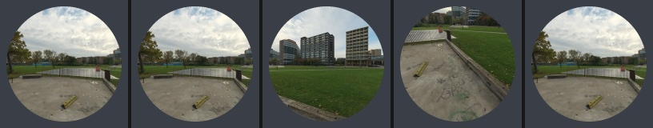

**Window with a fisheye projection, 180°.** The same view spread over the disc as an
orthographic fisheye:

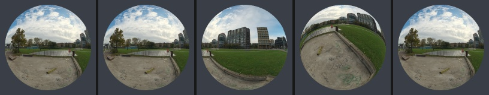

**Bubble.** Ray traced: the far inside wall of a transparent ball painted inside with the
panorama:

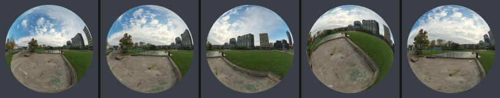

**Portal.** Every view ray through the orb shows the panorama in that same direction:

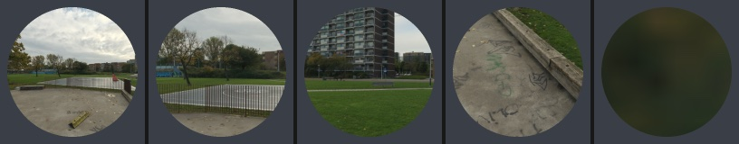

**Textured ball.** The outside of a ball painted with the panorama, as a globe is painted
with a map; this is what the original research's surface-normal mapping draws:

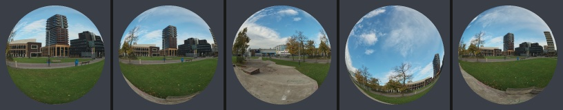

**Mirror ball and glass ball**, for completeness:

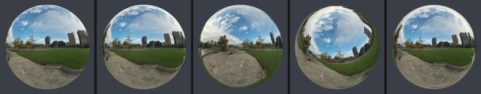
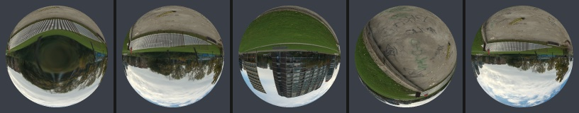

A synthetic fixture with the letters N, E and S on the horizon makes mirroring visible.
From the south, looking north, the window shows N the right way round:

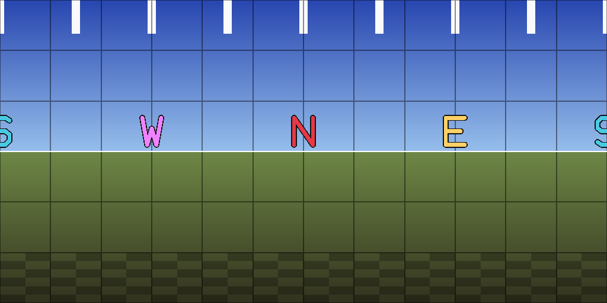
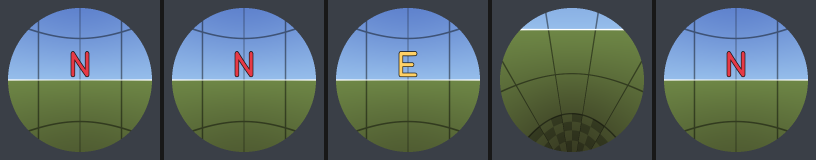

The textured ball shows S, which is behind the viewer, reversed:

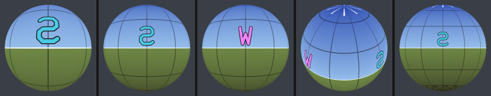

### Entry continuity

Here the camera flies at the orb's centre looking north with a 60° field of view, from 8
radii to inside it. The last frame is the immersive view from the capture point:

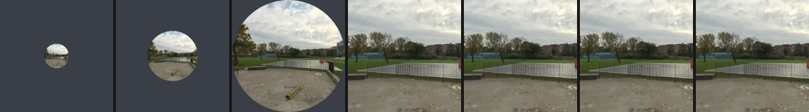
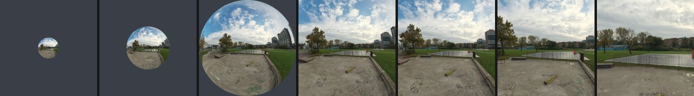
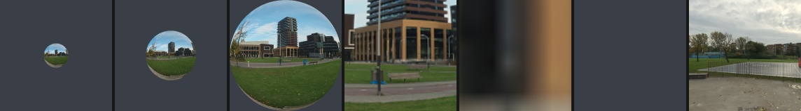

Mean absolute difference from the immersive view, 0–255 per channel, once the orb covers
the whole frame:

| Mapping | 1.25 radii | 1.02 radii | 0.6 radii (inside) |
| --- | ---: | ---: | ---: |
| Window, 90° | 0 | 0 | 0 |
| Portal | 0 | 0 | 0 |
| Bubble | 35.5 | 32.2 | 27.4 |
| Textured ball | 64.6 | 78.0 | 75.7 (nothing is drawn: the outside is culled) |

The window and portal are identical to the immersive view as soon as they fill the screen,
because they sample the view ray there by definition. The bubble matches only at its exact
centre. Getting there distorts the image from a 180° fisheye to the screen's field of view.
The textured ball shows the opposite hemisphere, mirrored, and has no continuous entry.

### What each mapping implies

| Mapping | Far away | Mirrors? | Entry | Source resolution needed at the orb's centre, orb D px across |
| --- | --- | --- | --- | --- |
| Portal | A cone of 2·asin(R/d); 1.15° at 100 radii | No | Exact | The immersive view's: about 5,900 px wide for 1080p at 60°, whatever the orb's size |
| Window, rectilinear, half-angle β | Fixed β, recognizable | No | Exact once the orb covers β; continuous before | Equirectangular π·D/tan β wide; cube face D/tan β (D at 90°) |
| Window, orthographic fisheye | A hemisphere; matches the bubble to 2.1/255 at 100 radii | No | Needs a projection blend to rectilinear while expanding | Equirectangular π·D; cube face D |
| Bubble, ray traced | A hemisphere | No | Continuous only by flying to the centre | As the fisheye |
| Textured ball | The hemisphere behind the viewer | Yes | Discontinuous | As the fisheye |
| Mirror, glass | Optical; glass is upside down | Mirror: yes | Discontinuous | Varies |

The portal's resolution demand is the decisive point against it. Its angular extent
shrinks with distance while its pixel size shrinks equally. It therefore always needs
the immersive source's resolution: a 6K panorama resident for every visible orb. A window
of fixed angle needs a source proportional to the orb's pixel size, which is what "use
distance to set the resolution" should mean.

### Recommendation

Adopt the **window family** as the rendering contract. The orb shows the panorama around
the direction from the camera to the orb, over a preview angle, with a chosen projection
across the disc. The flat window becomes the exact portal as the orb grows past the
preview angle; the fisheye does after its projection blend. The flat 90° window and the snow-globe fisheye are values of two appearance parameters of
one shader, and they cost the same. The fisheye matches the physically ray-traced bubble
at a distance. Its perspective up close differs, but that parallax carries no real
information, because a monoscopic panorama has no depth.

Which look ships by default is the user's choice ([decisions](#decisions-for-the-user)).
One observation bears on it: FOSS Earth's camera usually looks down at a campus. From
above, the 90° window shows mostly ground (fourth tile), while the fisheye keeps the
horizon and sky in view.

Reject the textured ball as the default. It mirrors text, shows what is behind the viewer
and breaks entry. Keep mirror and glass out of scope unless wanted deliberately as
decoration.

## The cheapest way to draw an orb

The user asked for "the computationally least expensive way to render a 360 image". For
a textured orb, one bound settles it: every pixel the orb covers must receive a colour
read from the panorama, so drawing it costs at least one texture read per covered pixel.
Nothing else is irreducible. Per fragment, the window mapping with a cube-map source is:

```text
// c: orb centre relative to the camera, R: radius, computed per orb on the CPU in float64
// r: the fragment's view ray; α = asin(R/|c|); cos α, tan α and tan β are per-orb constants
a     = c / |c|
cosT  = dot(r, a)                   // coverage: inside the silhouette when cosT >= cos α
off   = r / cosT - a                // offset in the plane tangent to the axis; |off| = tan θ
dir   = a + off * (tan β / tan α)   // rectilinear window; equals r when β == α (the portal)
color = textureSample(previewCube, previewSampler, dir)   // cube lookup needs no normalizing
```

That is about fifteen arithmetic operations and one filtered texture read, with no
trigonometry per pixel. The fisheye variant needs one square root more:
`s = |off| / tan α · sin β`, `dir = a·sqrt(1 − s²) + normalize(off)·s`. A ray-traced
bubble needs a square root for its far intersection. It too stays free of trigonometry
with a cube source.

An equirectangular source adds `atan2` and `asin` per pixel. It also adds a longitude seam
and pinched poles, which need explicit gradients (`textureSampleGrad`) or Tarini's
two-chart selection to filter correctly
([Tarini 2012](https://vcgdata.isti.cnr.it/Publications/2012/Tar12/jgt_tarini.pdf)).
WebGPU samples cube maps seamlessly across faces by specification, in the layer order
[+X, −X, +Y, −Y, +Z, −Z] ([WebGPU](https://www.w3.org/TR/webgpu/)). So the cheapest
correct source for previews is a mipmapped cube map. The mipmaps matter: without them a
small orb reads scattered texels of a large face, and aliases.

### Geometry: quad or sphere

For every window-family mapping, the colour at a pixel depends only on the view ray and
per-orb constants. A camera-facing quad and a tessellated sphere therefore produce
identical interiors. They differ only at the silhouette and in depth.

- A quad must be large enough to cover the silhouette cone. Centred on the orb and facing
  the camera, its half-size is R / cos α, which diverges as the camera nears the surface.
  Near and inside an orb, draw a full-screen triangle instead. Tight bounds for a projected
  sphere are in [Mara and McGuire](https://jcgt.org/published/0002/02/05/paper.pdf).
- A sphere's silhouette is a polygon. With n segments around a projected radius of R_px
  pixels, the edge error is R_px(1 − cos(π/n)). For at most 0.5 px:

  | Projected radius | Segments | Triangles, UV sphere n × n/2 |
  | ---: | ---: | ---: |
  | 16 px | 13 | 169 |
  | 64 px | 26 | 676 |
  | 128 px | 36 | 1,296 |
  | 512 px | 72 | 5,184 |

  Twenty spheres of 1,296 triangles total about 26,000 triangles. FOSS Earth's raster
  terrain measured about 5 million triangles of requested leaf geometry over Los Angeles
  ([raster terrain performance](../raster-terrain-performance.md)), so the orbs would add
  about 0.5%. The original research's claim that sphere meshes would "cripple the vertex
  pipeline" is wrong by orders of magnitude at this scale.
- "Sphere quality" therefore means silhouette segments, best expressed as an allowed edge
  error in pixels. It changes nothing inside the orb.
- Depth: a sphere mesh gets true depth for free. A quad can write the sphere's front
  surface depth, which Babylon's WGSL supports as `fragmentOutputs.fragDepth`, or use a
  plane through the centre. Writing depth disables early depth testing for those
  fragments, which matters little at this coverage.

### Fill cost

Covered pixels for twenty orbs of diameter D on a 1920×1080 frame:

| D | Pixels | Share of the frame |
| ---: | ---: | ---: |
| 32 px | 16,085 | 0.8% |
| 64 px | 64,340 | 3.1% |
| 128 px | 257,359 | 12.4% |
| 256 px | 1,029,437 | 49.6% |

Even twenty 256 px orbs cost about half a full-screen pass of one texture read. The
globe itself draws the whole frame with terrain and imagery. Orb shading is not where
the frame budget goes. Loading, decoding and holding panorama images are, and so is the
immersive view at full resolution.

## Caching versus recomputing

The user expected to trade compute for memory by caching sprites. For the window
mapping, the numbers say otherwise:

- **Per-frame cost is equal.** Displaying a cached sprite costs one texture read per
  covered pixel; drawing the window directly costs one texture read and fifteen
  operations. A cache adds a bake pass and render-target writes whenever it refreshes.
  The review's model `N·P` versus `U·B + N·S` has S ≈ P here, so caching cannot win on
  computation.
- **Camera rotation never changes the window's content.** The content depends on the
  direction from the camera to the orb, not on where the camera points. Only translation
  changes it. The camera must move `d · 2β / D` sideways to shift the content by one
  preview pixel:

  | D | Shift per pixel | At 30 m | At 100 m | At 300 m | At 1,000 m |
  | ---: | ---: | ---: | ---: | ---: | ---: |
  | 32 px | 2.81° | 1.5 m | 4.9 m | 14.7 m | 49.1 m |
  | 64 px | 1.41° | 0.7 m | 2.5 m | 7.4 m | 24.5 m |
  | 128 px | 0.70° | 0.4 m | 1.2 m | 3.7 m | 12.3 m |

  So a far orb's sprite would stay valid for many frames, but near orbs change every
  frame of motion. And FOSS Earth's [render scheduler](../../../src/engine/babylon/renderScheduler.ts)
  already draws nothing while the view is still.
- **What a cache actually saves is source memory.** A 64×64 RGBA8 sprite is 16 KiB. A
  128² preview cube with mipmaps is 512 KiB. With a cache, the source could be evicted
  and fetched again when the sprite goes stale. That matters with hundreds or thousands
  of orbs, not twenty to forty.
- Where the direct path costs more than one read per pixel, a cache can help: tiled
  sources that need indirection, or anisotropic filtering of an equirectangular source.
  Choosing cube previews avoids both.

Recommendation: draw directly by default. Keep "cache orb images" as the user asked, as
a setting with a budget in MiB and a refresh allowance, off by default. Include it in the
GPU experiment so the default rests on a measurement rather than this argument alone.

## Resolution, memory and delivery

### How much resolution is useful

Pixels per radian at the screen centre are (H/2) / tan(vfov/2). Multiplying by 2π gives
the equirectangular width that shows one texel per pixel. A cube face needs 2 × pixels
per radian.

| Display | Pixels per radian | Equirectangular width | Cube face |
| --- | ---: | ---: | ---: |
| 1080p, 60° vertical | 935 | 5,877 | 1,871 |
| 1440p, 60° | 1,247 | 7,836 | 2,494 |
| 2160p, 60° | 1,871 | 11,753 | 3,741 |
| Phone, 2400 px tall, 70° | 1,714 | 10,768 | 3,428 |
| 1080p zoomed to 30° | 2,015 | 12,663 | 4,031 |

Current cameras capture more than that: Ricoh Theta X at 11008×5504 (60 MP), Insta360 X5
at 72 MP and DJI Osmo 360 at 120 MP
([Theta X specifications](https://support.ricoh360.com/manual/x-add-info-01),
[Osmo 360 and X5 comparison](https://dronexl.co/2025/08/27/dji-osmo-360-insta360-x5-comparison/)).
The existing tour caps at 6144×3072, which is below 1440p's centre resolution at 60°.

For previews the rule is simpler: a cube face as wide as the orb's diameter in device
pixels gives one texel per pixel for a 90° window or the fisheye. A 128 px orb needs 128²
faces. Choose the next power of two and let mipmapping do the rest.

### Memory

Base level in MiB. Add one third for mipmaps. The cube face is W/π, which matches the
equirectangular image's resolution at the equator; this is the rule Pannellum's tiler
uses, `cubeSize = 8·int((360/haov)·origWidth/π/8)`
([generate.py](https://github.com/mpetroff/pannellum/blob/master/utils/multires/generate.py)).

| Equirectangular width | RGBA8, equirect / cube | BC7 or ASTC 4×4 | BC1 or ETC2 RGB |
| ---: | ---: | ---: | ---: |
| 1,024 | 2.0 / 2.4 | 0.5 / 0.6 | 0.25 / 0.3 |
| 2,048 | 8.0 / 9.7 | 2.0 / 2.4 | 1.0 / 1.2 |
| 4,096 | 32 / 39 | 8.0 / 9.7 | 4.0 / 4.9 |
| 6,144 | 72 / 88 | 18 / 22 | 9.0 / 11 |
| 8,192 | 128 / 156 | 32 / 39 | 16 / 19.5 |
| 16,384 | 512 / 623 | 128 / 156 | 64 / 78 |

This refines one of the review's corrections. At equal worst-case angular resolution, a
cube needs 6(W/π)² ÷ (W²/2) = 1.216 times the texels of an equirectangular image. The
original research was right that equirectangular is smaller, by 18%. It was wrong about
why, and wrong that this makes it preferable. The cube buys trigonometry-free, seamless
sampling. It also fits more resolution under WebGPU's default `maxTextureDimension2D` of
8192: an 8192 cube face carries the detail of a 25,700-wide equirectangular image, while
an equirectangular texture stops at 8192×4096.

For a tour of 43 panoramas, 128² preview cubes cost 43 × 0.5 MiB ≈ 21.5 MiB uncompressed,
or about 5.4 MiB compressed. One full 6144 panorama decoded for immersion costs 72–96 MiB
uncompressed. The budgets that matter are the active panorama's full resolution and how
many neighbours are prefetched, not the orbs.

### Compression

WebGPU guarantees that every adapter supports either `texture-compression-bc`, or both
`texture-compression-etc2` and `texture-compression-astc`
([WebGPU §4.2.1](https://www.w3.org/TR/webgpu/)). A GPU-compressed panorama therefore
always has a target format. Desktop GPUs typically expose BC, and phones ETC2 and ASTC.
KTX2 with Basis Universal can carry one file and transcode it at load. Transcoding costs
time and some quality ([Castaño, 2026](https://www.ludicon.com/castano/blog/2026/01/choosing-texture-formats-for-webgpu-applications/));
the experiment should measure both on target phones. JPEG, WebP and AVIF decode to
uncompressed textures, 4 bytes per texel.

### Tiling for immersion

A 16:9 view at 60° vertical covers 1.47 sr, 11.7% of the sphere. A portrait phone at 70°
covers 5.6%. A tiled cube pyramid (Pannellum, Marzipano) therefore holds the finest level
for roughly a tenth of the sphere. A 16K source needs about 60 MiB of finest tiles
instead of 512 MiB, and the first image arrives sooner. Whole-image variants are simpler
and workable up to about 8K on desktops, at 32–128 MiB each. Above that, or on phones at
full resolution, tiling is what makes the source fit.

## Placement and orientation

### Height

At 44.974° N, 93.235° W the geoid heights are EGM2008 −27.30 m and EGM96 −27.95 m
([GeographicLib GeoidEval](https://geographiclib.sourceforge.io/cgi-bin/GeoidEval?input=44.9740+-93.2350)).
A GNSS ellipsoid height there is 27.3 m less than the same point's height above sea level.

FOSS Earth enters Terrarium heights, which are relative to sea level, directly as
ellipsoid heights with no geoid correction ([streamed terrain](../../streamed-terrain.md)).
Google's photorealistic tiles use ellipsoid heights. So a capture point stored as a true
ellipsoid height sits about 27 m below the raster terrain surface at this campus, and at
the right height on Google's. A point stored as a sea-level height does the reverse.
Exif defines GPS altitude against sea level (CIPA DC-008), while the Street View Publish
API and OGC GeoPose use metres above the WGS84 ellipsoid.

Recommendation for the format:

- Store the capture position as latitude, longitude and height above the WGS84 ellipsoid,
  as GeoPose and Street View do. When the source height is sea level, the importer
  converts it with a named geoid model; it never relabels the height.
- Store the marker's display position separately, as a height above the displayed ground
  surface. The window mapping shows directions only, so a marker floating 4 m above its
  capture point shows exactly the same picture.
- Treat the raster terrain's missing geoid correction as FOSS Earth's defect to fix. Until
  then, capture heights and displayed terrain disagree by the local geoid height.

### Orientation conventions

| Source | Position | Direction of the image centre or view | Other |
| --- | --- | --- | --- |
| [GPano XMP](https://developers.google.com/streetview/spherical-metadata) | None | `PoseHeadingDegrees` clockwise from north; `PosePitchDegrees` above the horizon; `PoseRollDegrees` | R = R_Z(−heading)·R_X(pitch)·R_Y(roll), Z up, X east, Y north. Separate initial view and crop fields. |
| [Street View Publish Pose](https://developers.google.com/streetview/publish/reference/rest/v1/photo) | `latLngPair`, `altitude` in metres above the WGS84 ellipsoid | `heading` clockwise from north, 0 to 360; `pitch` −90 to 90; `roll` | `level` for floors; `accuracyMeters`; `connections` to other photos |
| [OGC GeoPose Basic-YPR](https://github.com/opengeospatial/GeoPose) | `lat`, `lon` in degrees, `h` in metres above the WGS84 ellipsoid | `yaw`, `pitch`, `roll` in degrees: rotations about the local z, y, x axes of east-north-up, in that order | Yaw turns counter-clockwise seen from above, unlike a compass heading |
| [Google Maps URLs](https://developers.google.com/maps/documentation/urls/get-started) | `viewpoint` lat,lng or `pano` id | `heading` clockwise from north; `pitch` −90 to 90 | `fov` horizontal, 10–100°, default 90 |
| [Pannellum](https://pannellum.org/documentation/reference/) | None | `northOffset`: the panorama centre's offset from north; hotspot `yaw`/`pitch` | `hfov` default 100, 50–120; scene links with `targetYaw`/`targetPitch`/`targetHfov` |
| [Photo Sphere Viewer tours](https://photo-sphere-viewer.js.org/plugins/virtual-tour.html) | `gps: [lon, lat, alt?]` | `sphereCorrection: {pan, tilt, roll}` | Links place themselves from GPS in `positionMode: 'gps'` |
| [CesiumJS panoramas](https://cesium.com/learn/cesiumjs-learn/display-panoramic-images/) | `transform`, a Matrix4 | `HeadingPitchRoll` through `headingPitchRollToFixedFrame` | |
| YouVisit (observed) | Stop latitude and longitude | `start_lon`, `start_lat` in degrees | `start_fov` 100 |

Use GPano's conventions for the image pose, because cameras write them. Name the
convention in the file. Convert explicitly to and from GeoPose, whose yaw has the opposite
sense and needs a stated forward axis. Never reinterpret either set as Babylon Euler
angles.

## Screen size, discovery and picking

Projected diameter is H·r / (d·tan(vfov/2)). For a 900 CSS px tall view at 60°:

| Orb radius | At 50 m | At 200 m | At 500 m | At 2,000 m |
| ---: | ---: | ---: | ---: | ---: |
| 1 m | 31 px | 7.8 px | 3.1 px | 0.8 px |
| 3 m | 94 px | 23 px | 9.4 px | 2.3 px |
| 5 m | 156 px | 39 px | 16 px | 3.9 px |

At the campus's stop spacing:

| Camera distance | Metres per CSS px | Median spacing, 85 m | Minimum spacing, 13 m |
| ---: | ---: | ---: | ---: |
| 300 m | 0.38 | 221 px | 34 px |
| 1,000 m | 1.28 | 66 px | 10 px |
| 3,000 m | 3.85 | 22 px | 3.4 px |
| 8,000 m | 10.3 | 8 px | 1.3 px |

WCAG 2.2 asks for pointer targets of at least 24 × 24 CSS px, or enough spacing, or an
equivalent control ([SC 2.5.8](https://www.w3.org/WAI/WCAG22/Understanding/target-size-minimum.html)).
So:

- World-sized orbs vanish beyond a few hundred metres. Orbs need a minimum on-screen
  diameter, which makes them screen-sized at a distance, as map markers usually are.
- From about 1 km out, neighbouring stops overlap. Clustering, or showing a subset with a
  list for the rest, is required, not optional. The scene list is also the "equivalent
  control" for accessibility and for stops hidden behind buildings.
- Pick against the drawn shape: a ray–sphere test per orb on the CPU, with any enlarged
  touch tolerance set deliberately in CSS px. Twenty to forty tests per click cost
  nothing.
- For occlusion by 3D buildings, CesiumJS's
  [`disableDepthTestDistance`](https://cesium.com/learn/cesiumjs/ref-doc/Billboard.html) on
  billboards is the familiar compromise: depth-tested far away, drawn through occluders near. Whether
  hidden orbs show through as outlines is a design choice.

## Entering, looking and leaving

### Expanding in place

With the window mapping, entry does not need to move the globe camera at all. Grow the
orb's radius around its centre. Once it passes the preview angle it is the exact portal.
Once it covers the screen, every pixel shows the panorama in the direction of its view
ray, which is the immersive view for the current camera orientation. Switching to the
immersive renderer at that moment changes no pixel. Leaving is the reverse, and the globe
view underneath never changed, so the user returns exactly where they were. This matches
the user's own word, "expand".

The camera still has to turn during entry, because the globe camera usually looks down at
40–60°. Entering in place would start the immersive view staring at the ground. The entry
animation should therefore also rotate the camera toward the panorama's initial view, or
at least level its pitch. In the portal regime rotation is a plain pan of world-locked
content, so this stays continuous. The fisheye look additionally blends its projection to
rectilinear as the orb grows. That blend is a one-dimensional remapping of angle from the
centre, and it needs a prototype to tune.

The same mechanism can serve links inside a panorama: show the next stop as a window orb
in its direction and expand it. That gives one interaction for the globe and for the tour.

### Looking

Established viewers agree on the basics. Dragging rotates the view, wheel and pinch
change the field of view, arrow keys look around, and movement carries some inertia.

| Viewer | Field of view | Inertia |
| --- | --- | --- |
| Pannellum | `hfov` 100°, limits 50–120° | `friction` 0.15 |
| Photo Sphere Viewer | `minFov` 30°, `maxFov` 90° | `moveInertia` 0.8 |
| Google Maps URLs | `fov` 10–100°, default 90° | |

CesiumJS's own recipe for viewing its panoramas parks the camera 2 m from the centre with
`lookAt`, enables rotate and tilt, disables translate and zoom, and changes the field of
view instead ([CesiumJS guide](https://cesium.com/learn/cesiumjs-learn/display-panoramic-images/)).
A panorama session in FOSS Earth needs the same: its own input ownership, and field of
view as zoom.

### Moving between stops

Photo Sphere Viewer turns toward the link, then fades, at a default `speed` of `'20rpm'`
with `effect: 'fade'` ([transition options](https://photo-sphere-viewer.js.org/api/types/virtualtourplugin.virtualtourtransitionoptions)).
Pannellum can carry the look direction across with `targetYaw: 'sameAzimuth'`. Street View
is reported to cross-fade, and to use a coarse depth map per panorama where it has one
([Google Maps Mania](https://googlemapsmania.blogspot.com/2015/03/creating-seamless-street-view.html),
a secondary source).

For the URL, Google's `heading`, `pitch` and `fov` parameters are a sound model. Encode
scene, stop and view direction so a shared link opens the same view. Entry and fly-overs
must honour `prefers-reduced-motion` with a cut or fade
([WCAG 2.3.3](https://www.w3.org/WAI/WCAG22/Understanding/animation-from-interactions.html)).

## Prior art

- **CesiumJS 1.139 (March 2026)** added `EquirectangularPanorama` and `CubeMapPanorama`,
  and a `GoogleStreetViewCubeMapPanoramaProvider`
  ([announcement](https://cesium.com/blog/2026/03/05/introducing-panoramic-imagery-in-cesiumjs/)).
  In its source, the equirectangular panorama is a `SphereGeometry` of radius 100 km,
  unculled, with a horizontally flipped image material. The cube panorama uses the skybox
  shader on a box, with depth test and depth writes off. There are no preview markers and
  no transitions. Its cube path samples by direction, as a skybox does, which is all the
  immersive view needs; a full-screen pass does the same without a box.
- **Google's patent US9418472B2**, "Blending between street view and earth view", is
  active until 2034-09-10 ([patent](https://patents.google.com/patent/US9418472B2/en)).
  Its claim covers colouring 3D-model fragments from a panorama by their geospatial
  position, with a blending ratio set by the camera's position or orientation. Projecting
  panoramas onto Google's 3D tiles during a transition would come close to it and needs
  legal review first. Expanding a window orb samples by view direction, not by projecting
  onto model fragments. This note is not legal advice.
- **Matterport** places unaligned 360° views by hand, shown as a rotatable sphere while
  editing ([help](https://support.matterport.com/hc/en-us/articles/360008784253-Place-your-360%C2%BA-Views-in-Workshop)).
- **Usability evidence is thin.** Published work on 360° tours is mostly frameworks and
  pilots, not controlled comparisons of navigation designs. Shikhri, Lanir and Poretski
  reviewed over 40 tours. Their framework separates movement experience (smooth
  transitions against instant jumps), freedom of movement, and spatial orientation
  through a persistent map ([WebTour 2021](https://ceur-ws.org/Vol-2855/main_short_4.pdf)).
  A globe provides the persistent map. The evaluation the review proposes will be the
  first real evidence for this design.

## Facts for the FOSS Earth integration

- **Device capabilities.** [createRendererMode](../../../src/engine/babylon/createRendererMode.ts)
  passes `deviceDescriptor: { requiredFeatures: ["timestamp-query"] }`. With explicit
  features, Babylon 8.56.2 enables nothing else, and without `setMaximumLimits` it takes
  default limits. So compressed textures are unavailable, and 2D textures stop at 8192.
  Compressed panoramas need `texture-compression-bc`, `-etc2` and `-astc` requested where
  the adapter has them. Sources above 8192 need the adapter's `maxTextureDimension2D`
  requested, or cube faces.
- **KTX2 cube maps.** Babylon's `_KTXTextureLoader.loadCubeData` reads only KTX1, both in
  8.56.2 and on upstream master. A compressed preview cube needs a small custom path:
  transcode six KTX2 faces and upload them into one cube texture. The alternative is
  uncompressed cubes, which are 21.5 MiB for 43 previews at 128².
- **Shaders.** Babylon's WGSL processing handles `texture_cube<f32>` and maps
  `fragmentOutputs.fragDepth` to `@builtin(frag_depth)`; thin instances draw every orb in
  one call. FOSS Earth's
  [imagery material plugin](../../../src/engine/babylon/imagery/imageryMaterialPlugin.ts)
  already keeps WGSL and GLSL versions and samples with explicit gradients
  (`textureSampleGrad`, `textureGrad`). A WebGL version of the
  orb shader would therefore be about twenty more lines, which makes the no-WebGPU
  fallback cheap if wanted.
- **Precision.** The scene is right-handed with large-world rendering. The window mapping
  needs per orb only its centre relative to the camera, computed in float64 on the CPU.
  Earth-sized coordinates never reach the shader.
- **Browser support**, as of the status page's 2026-08-13 revision
  ([implementation status](https://github.com/gpuweb/gpuweb/wiki/Implementation-Status)):

  | Browser | Shipping | Not yet |
  | --- | --- | --- |
  | Chrome and Edge | Windows, macOS and ChromeOS from 113. Android 12+ on ARM, Qualcomm and Intel GPUs from 121; Imagination GPUs on Android 16+ from 139. Linux on Intel Gen12+ from 144 and NVIDIA under Wayland from 147. | Samsung phone GPUs; Windows on ARM and other Linux GPUs behind a flag |
  | Safari 26 | macOS, iOS, iPadOS, visionOS | |
  | Firefox | Windows from 141; macOS from 147 | Linux and Android: Nightly only |

  Some current phones therefore still have no WebGPU, which is the case for the cheap
  GLSL fallback.

## Scene format: what the prior art settles

Every format surveyed separates a node's image from its links and gives links a target ID
plus an optional direction. Geographic formats add position, and Street View adds floors.
Across them, a first version needs:

| Group | Fields, with the convention each must name |
| --- | --- |
| Capture | Latitude, longitude in degrees; height in metres above the WGS84 ellipsoid; optional horizontal accuracy; optional floor |
| Image pose | Heading clockwise from north, pitch, roll of the image centre, in the GPano convention |
| Marker | Display height above the displayed ground, in metres; radius; appearance parameters, if the scene may suggest them |
| Initial view | Heading, pitch, horizontal field of view in degrees |
| Representations | Preview cube levels (face sizes), immersion as whole images or a tiled cube pyramid, formats, relative URLs, content revision |
| Links | Target stop ID; optional direction override; label |
| Content | Title and description per language; narration audio per language; photos; videos; accessibility descriptions. The existing tour uses all of these; which ship first is a decision. |
| Attribution | Per asset, as Cesium requires `credit` |

This extends the draft spec's table rather than replacing it. The draft's
separation of assets from placed entities, its validation rules and its "no scripts, no
shaders" stance all stand.

## Parameters the findings imply

These fill in units, bounds and defaults for the draft spec's
[settings inventory](../panorama-scenes.md#settings-inventory-to-complete), where the
research gives a reason. Anything unmeasured stays an explicit gap.

| Parameter | Unit and bounds | Default and reason |
| --- | --- | --- |
| Orb preview angle | Degrees, full angle, 30–180 | 90 flat, 180 fisheye: the figures above |
| Orb projection | Flat or fisheye | [Decision](#decisions-for-the-user) |
| Preview density | Texels per device pixel at the orb's centre, 0.25–2 | 1: one texel per pixel, the resolution rule |
| Preview face size | Pixels, one range track, 16–1024 | Chosen per orb inside the range by the density rule |
| Minimum orb size | CSS px diameter, 12–96 | 24: WCAG 2.5.8 |
| Silhouette error, sphere mesh | Pixels, 0.1–4 | 0.5: segments from R_px(1 − cos(π/n)) |
| Immersion resolution | Texels per device pixel, 0.25–2 | 1: the display table above |
| Panorama GPU budget | MiB | Gap: set per target device after measuring |
| Prefetch | Stops, and MiB | Gap: the existing tour's full-size prefetch is 4.3 MB compressed and 144 MiB decoded for two stops |
| Sprite cache | On or off, MiB, refresh ms per frame | Off: [caching](#caching-versus-recomputing) |
| Entry duration | Milliseconds, with reduced motion replacing it by a cut or fade | Gap: tune with the prototype |

## Decisions for the user

Research cannot settle these. Each has a recommended starting point.

| Decision | Recommendation | Why |
| --- | --- | --- |
| Orb look | The window family. Choose flat 90° or fisheye by eye from the figures, or expose both as an appearance setting. My lean is the fisheye, because the globe camera looks down and the fisheye keeps the horizon. | Same cost; both enter continuously; the fisheye needs a projection blend during expansion |
| Textured ball as an option | No | Mirrors, shows the wrong hemisphere, breaks entry |
| First-release content | Panoramas, links, per-language text and narration first; photos and videos next | The existing tour carries all of them; narration in four languages is an accessibility and audience commitment |
| Registration and lead capture | Not in FOSS Earth; if the client wants it, in the tour application, never blocking the view | Product choice, not globe functionality |
| Sprite caching | A setting, off by default, kept in the GPU experiment | Cannot save per-frame work for the window mapping |
| No WebGPU | Offer the GLSL version of the orb shader | FOSS Earth already maintains both shader languages |
| Target devices and numbers | Name two or three phones and one laptop, with frame-time and first-image targets | Required before any performance acceptance |

## What still needs measuring

Measure these with the actual globe running, on named devices, after the decisions above:

1. **Orb draw time** for 20 and 200 orbs at 32–256 px: direct window against a sphere mesh
   against cached sprites, at matched output.
2. **Decode and upload** for preview and full sources: JPEG, WebP, AVIF and KTX2
   transcoding, with time to first image and main-thread stalls, on the target phones.
3. **Memory** against the arithmetic above, including staging copies and transitions.
4. **Entry** frame times, including the switch to the immersive renderer and whether the
   globe pauses behind it.
5. **Usability**: time and mistakes for finding a stop, entering, looking around, moving
   on and returning, against the existing tour, as the review proposed.

## Reproducing the figures

```sh
node scripts/render-orb-appearances.mjs                        # synthetic fixture
curl -o build/research/sources/buikslotermeerplein.jpg \
  "https://dl.polyhaven.org/file/ph-assets/HDRIs/extra/Tonemapped%20JPG/buikslotermeerplein.jpg"
sips -s format png --resampleWidth 2048 build/research/sources/buikslotermeerplein.jpg \
  --out build/research/sources/buikslotermeerplein-2048.png   # macOS; any PNG converter works
node scripts/render-orb-appearances.mjs --panorama build/research/sources/buikslotermeerplein-2048.png
```

The downloaded JPEG was 8192×4096 with MD5 `8f7a696c42911c7c0a3ef2f46d3ca4e6`. Each run
writes its strips and `report.json`, holding the entry-continuity and fisheye-versus-bubble
numbers, to `build/research/panorama-orbs/<timestamp>/`. Photographic strips were
converted to JPEG at quality 85 for this document.
