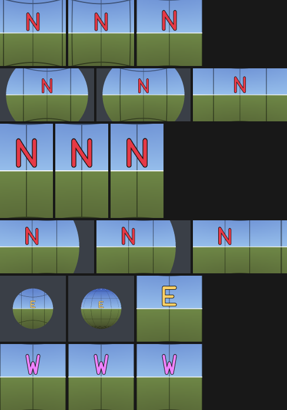
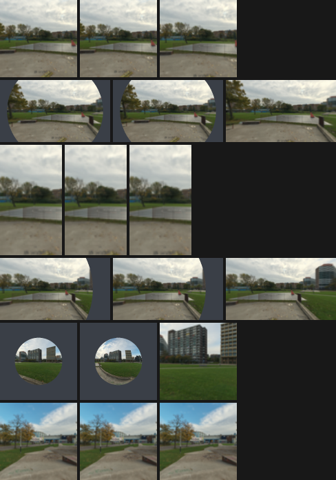

# Panorama window: CPU visual contract

Validated 2026-09-27 UTC in FOSS Earth's
[CPU reference](../../scripts/render-orb-appearances.mjs). This closes a small math
contract for the [implementation proposal](../proposals/panorama-scenes.md), not a
production renderer. Configuration, figures, hashes and reproduction commands are
retained in [the evidence directory](../../validation/evidence/panorama-scenes/visual-contract-2026-09-27/README.md).

## Exact coverage and handoff

Let `C` be the current world camera, `M` the displayed sphere center, `R > 0` its
radius, and `v` a unit world view ray. For `d = |M−C| > R`, define
`a = (M−C)/d`, `α = asin(R/d)`, and `δ = atan2(|v−(a·v)a|, a·v)`.
The orb covers exactly the angular cap `a·v ≥ cos α`, equivalently `δ ≤ α`.
This is silhouette coverage before terrain or other occluders; an occluded pixel
is not eligible for the image handoff.

For a rectangular perspective viewport with positive dimensions and vertical FOV
strictly between 0° and 180°, full coverage holds exactly when **all four corner
rays** satisfy the cap inequality. The cap's cone is convex for `α ≤ 90°`; every
unnormalized interior ray is a positive combination of corner rays, so this also
covers edges and interior. Recompute with actual aspect, orientation and roll.
At `d = R`, use the closed inward hemisphere `a·v ≥ 0`, including its boundary by
the exterior limit. At `d < R`, all rays are covered and the window is identity;
do not compute an axis at `d = 0` or evaluate `asin(R/d)` inside.

For the flat window with preview half-angle `0 < βR < 90°`, define

```text
ρ = tan δ / tan α = sin δ cos α / (cos δ sin α),  0 ≤ ρ ≤ 1
θR = δ                                      when α ≥ βR
θR = atan2(ρ sin βR, cos βR)                  otherwise
k = [v − (a·v)a] / |v − (a·v)a|               when δ > 0
D = cos θR a + sin θR k                      with D = a when δ = 0
```

For an exterior, nondegenerate viewport, full directional equality requires
`α ≥ βR`, equivalently `R < d ≤ R/sin βR`; coverage is an additional test.
Thus the handoff contract requires every viewport ray to be covered **and** have
`D = v`. At the surface, retain hemisphere coverage plus identity; inside, both
ray conditions hold automatically. Preserve image pose, camera orientation and
FOV, source readiness, source filtering, color processing and compositing across
the switch. Equal directions alone cannot guarantee equal output pixels.

The required counterexample is reproduced: at `d = 1.5R`, `α = 41.8103149°`.
A square 60°-vertical-FOV viewport's corner is `39.2315205°` away, so it is covered.
With 90° full preview FOV (`βR = 45°`), its 30° ray nevertheless samples
`32.8421304°`. The maximum covered ray error in that frame is about 3.1605°.

An inward-looking trajectory can finish the handoff before crossing the surface.
A trajectory looking outward across `d = R` has a real coverage discontinuity:
its outward ray is absent at the surface and present just inside. An inside
identity branch does not fix that earlier discontinuity. During concurrent
rotation, coverage can be lost even after `α ≥ βR`; recompute it or postpone the
turn. A screen-space expansion/selected-overlay policy requires its own later
visual test and is not validated by these world-sphere figures.

## Continuous fisheye-to-flat mapping

The new `orthographic-blend` mapping uses a separate fisheye half-angle
`0 < βF ≤ 90°` and two angular thresholds `0 < αstart < αend ≤ βR`:

```text
t = clamp((α − αstart) / (αend − αstart), 0, 1)
λ = t² (3 − 2t)
θF = asin(clamp(ρ sin βF, 0, 1))
θ = (1 − λ) θF + λ θR
D = cos θ a + sin θ k
```

Provisional reference values are `βF = 90°`, `βR = 45°`, `αstart = 20°`,
`αend = 45°`. These are visible appearance/entry parameters to be evaluated in
interaction, not GPU budgets or user-approved preferences. The fisheye endpoint
is a fixed orthographic preview; the flat endpoint is the same flat window defined
above. At `λ = 1`, bypass fisheye evaluation, and when `α ≥ βR`, return the input
ray directly. This avoids `tan(90°)` and expressions such as zero times an invalid
quantity near the surface. At `δ = 0`, return `a`; at the rim use the closed
`ρ = 1` limit. Clamp only floating-point overshoot, not legitimately uncovered rays.

For fixed `α`, both endpoint maps are strictly increasing on the interior radial
domain; a scalar convex combination remains strictly increasing. Both angles are
finite in `[0, 90°]`, and the direction has unit length. The formulas and endpoint
branches agree continuously. The blend reaches identity by `α ≥ βR`; its handoff
policy also requires `λ = 1` and full coverage. A camera turn changes `a`, `v` and
coverage continuously while those geometric inputs remain defined; identity is
independent of axis once reached.

This is **C0 continuity, not uniformly smooth derivatives**. For `βF = 90°`,
`dθF/dρ = 1/sqrt(1−ρ²)` diverges as `ρ → 1` whenever fisheye weight remains.
For `βF < 90°`, it is `sin βF / sqrt(1−ρ² sin² βF)` and stays finite at the rim.
The flat `max(α, βR)` rule also has a time-derivative kink as `α` crosses `βR`:
smoothstep weights do not remove it. The perceptual effect of this velocity
change, the fisheye stretching and concurrent leveling remains an interactive
acceptance question. No bounded-gradient or motion-comfort claim is made.

The CPU reference uses 3 × 3 coverage supersampling and bilinear equirectangular
sampling with horizontal wrap and vertical clamp. It interpolates encoded RGB
bytes, so it validates mapping rather than a production color pipeline. Production
needs antialiasing at the silhouette, seam/pole-safe filtering and appropriate
source mip/footprint selection, especially at the fisheye rim. Source LOD changes
must not be hidden inside a supposed exact handoff; use the same ready source on
both paths during comparison, then separately qualify refinement. Cube seams,
mips, anisotropy, linear-light processing and texture compression are not tested
here. Center-density size formulas remain heuristics, not sampling bounds.

The retained historical `orthographic` branch remains deliberately unblended.
For a 30° ray at `d = 1.000001R` it samples about 0.0468°; just inside it abruptly
samples 30°. It is a negative control, not an alternative validated entry path.

## Flights and the exit handoff

With `scene.panorama.flightDuration` on, the camera itself flies into the orb
on entry and back out of it on exit ([panoramaFlight.ts](../../src/scenes/panoramaFlight.ts)).
The sphere is drawn at one radius `R` throughout a flight: the orb's projected
size where the flight begins (in) or ends (out). The eye moves on a line through
`M`, so both handoffs happen inside the sphere, at `d = R/2`, where every ray is
covered and `D = v` whatever the orientation. The eye never reaches `d = 0`,
where the axis is undefined.

**Entry** ends there. The loader requires `handoffReady` for the flight's last
pose, with that pose's own orientation, roll and field of view, then presents the
same view full screen. Both sides draw the orb's preview.

**Exit** hands off the other way, from the fullscreen image to the sphere, in
the flight's first frame. It is exact when all three hold:

1. Every viewport ray is covered and `D = v`: the eye is inside, at `d = R/2`.
   The loader checks `handoffReady` for the first pose and fades instead if it
   fails.
2. The globe camera's orientation, roll and vertical FOV equal the
   presentation's. The first pose is the presentation's forward, up and FOV, and
   the runtime places the camera with that up rather than its own level one; the
   roll unwinds during the flight.
3. The sphere samples the same source as the image did: the image on screen,
   cube or equirectangular, not the orb's preview, with the same filtering (the
   seam-aware gradients for an equirectangular image) and one output conversion,
   drawn over everything at full opacity.

Equal directions alone cannot guarantee equal pixels, as above; GPU float
precision and filtering remain to be checked on a device.

On the way out the camera always looks at `M`, so it leaves the sphere looking
inward and coverage shrinks continuously, as the reveal does in reverse. On the
way in, the view turns toward `M` as it closes in. An orb far off the view's
axis and within a few radii can still be crossed with rays pointing away from
`M`: the outward-crossing discontinuity described above, where corner rays
become covered at `d = R`. The orb's overlay is then only partly revealed.

The CPU reference's rows inside the sphere (`0.6R` and the centre) exercise the
condition in 1; it was not re-run for the flights. The unit tests check both
flights' ends against `handoffReady`, the placed camera's pose with roll on
Babylon's own camera, and the exit's source.

A flight cut short hands off nothing between renderers: the image is not on
screen, only the globe camera and the sphere. Its braking starts from the
flight's last frame, with that frame's pose and sphere, and ends as the globe
camera's orbit with the same eye, look, level up and field of view as the
braking's last frame, and with the orb at its own size and without overlay,
which is how the orb draws once the sphere is gone. A press or another
navigation that stops the braking early settles the orbit at once from where
it is; the field of view, roll and a tilt beyond the globe's limits then jump
by what the braking had left of them.

## Position and orientation meaning

Capture position `P` locates where the photograph was recorded. Display position
`M` locates its marker and controls silhouette, picking and the clipping axis
`a`. The mapped world content direction is `D`, then an image-pose rotation maps
it into the photograph's coordinate system. These are distinct quantities.
The reference's image pose is identity in local east/north/up (`x/y/z`) and its
equirectangular center faces north. A common orthonormal image-pose rotation
preserves all angular-equality results.

The camera-responsive window centers content on `a`. Moving the marker therefore
changes the sampled central direction: with camera `(0,−10,0)`, capture `(0,0,0)`
and marker `(0,0,1)`, its axis changes by `5.710593°`. Keeping content aimed at
capture instead would be a different projection with separate silhouette/content
axes, requiring a separate entry blend and new evidence. No monoscopic mapping
claims physical translation/parallax between `M` and `P`.

The proposal should keep overview restoration independent of these directions:
save the original overview once, preserve the actual incoming camera at handoff,
and perform any leveling or initial-view rotation as an explicit later motion.
Visiting another panorama must not overwrite the saved overview. These are
navigation requirements; this CPU tool has no navigation state machine.

## Results and limits

The compact comparison columns are flat window, fisheye blend and immersive
reference. The six rows are the square counterexample, landscape uncovered
corners, portrait near equality, concurrent turn, east-facing active blend and
west-facing near-surface identity. Background is excluded from numerical errors.





Each input ran 252 combinations: square, landscape and portrait; centered,
concurrently yawing/pitching/rolling, and raised/offset markers; flat and blended
appearances; fourteen distances from `8R` to the center, including either side
of `R/sin(45°)` and `R`. Each configuration measures 49 × 37 rays including
corners and edges. Missing rays are counted and excluded from mean image and
direction errors, so unchanged background cannot dilute them; maximum angular
error is also reported independently of either fixture's visual texture.

| Check | Result |
| --- | --- |
| Eligible handoffs per input | 114/252 |
| Maximum handoff ray error | 0° (direct input-ray branch) |
| Maximum handoff synthetic RGB channel error | 0 on 0–255 scale |
| Maximum handoff photographic RGB channel error | 0 on 0–255 scale |
| Radial monotonicity/finiteness samples | 83,025, all pass |
| Maximum analytic endpoint mismatch | 0° in the sampled configurations |
| Invalid projection/viewport configurations rejected | 9 |
| Accepted extreme viewport-FOV boundary/center rays | 45, all finite |

Radial sweeps exercise fisheye half-angles `0.01°, 45°, 90°`, rectilinear
half-angles `0.01°, 45°, 89.9999°`, and near-zero/near-surface angular sizes.
Perspective vertical FOV checks include `0.01°, 60°, 179.999°`; exactly 180° is
rejected. Practical UI bounds can be narrower. The endpoint boundary difference
for fixed interior rays shrinks from `0.0098566°` to `0.0000009848°` as the tested
angular neighborhood shrinks from ±0.01° to ±0.000001°.

The fixture shows readable cardinal letters and a grid; the retained photograph
is a compact downsample of the existing research fixture. Its smoothness and
resolution cannot conceal errors in the independent ray metrics. These are CPU
double-precision checks and a mathematical construction, not exhaustive GPU
float/filtering validation. Later work must check actual shader tolerances,
occlusion/depth, mesh/quad parity, aliasing, temporal LOD, device loss, interaction
and motion comfort, plus the cost with the globe running. No GPU benchmark, dev
server or device qualification was performed here.
